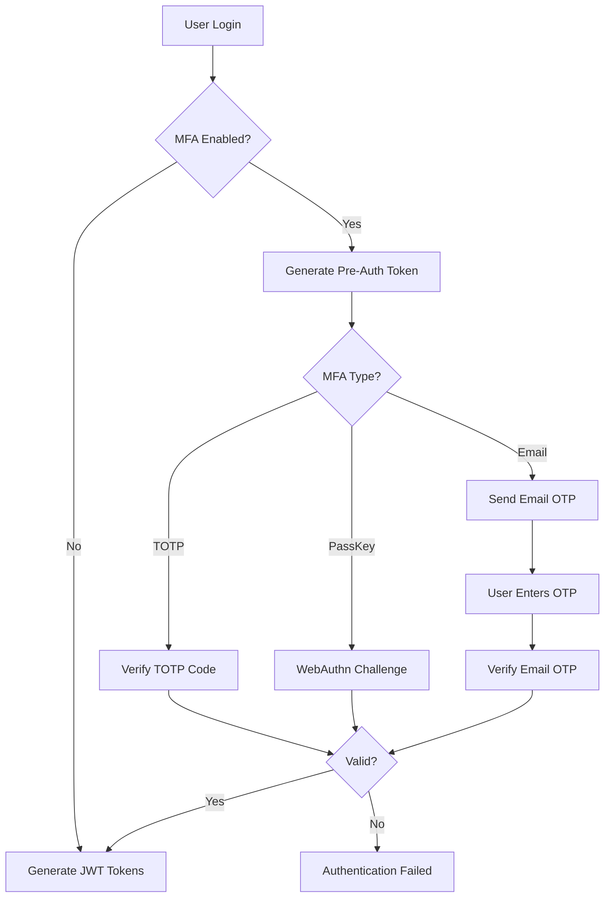
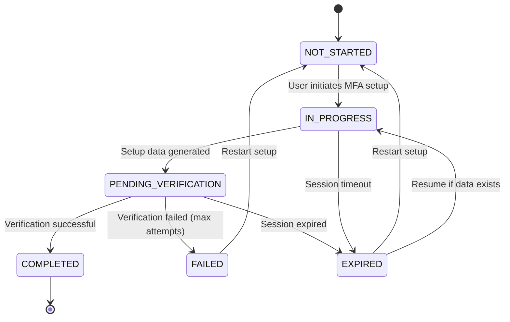
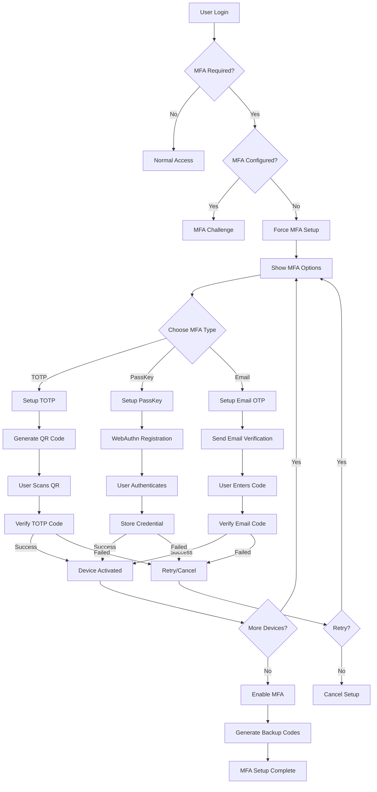
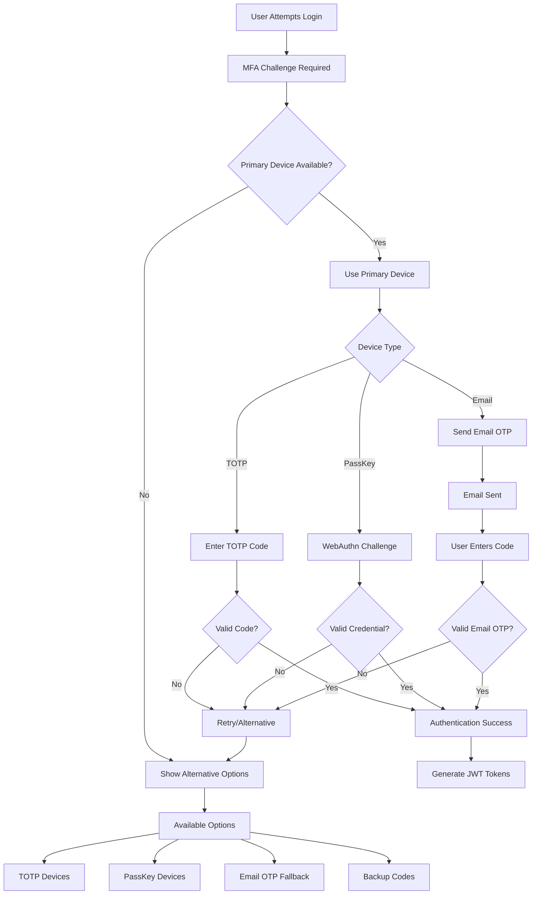
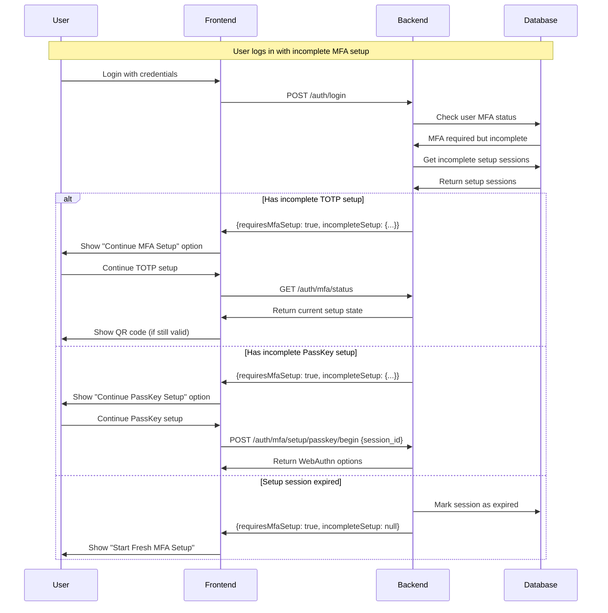
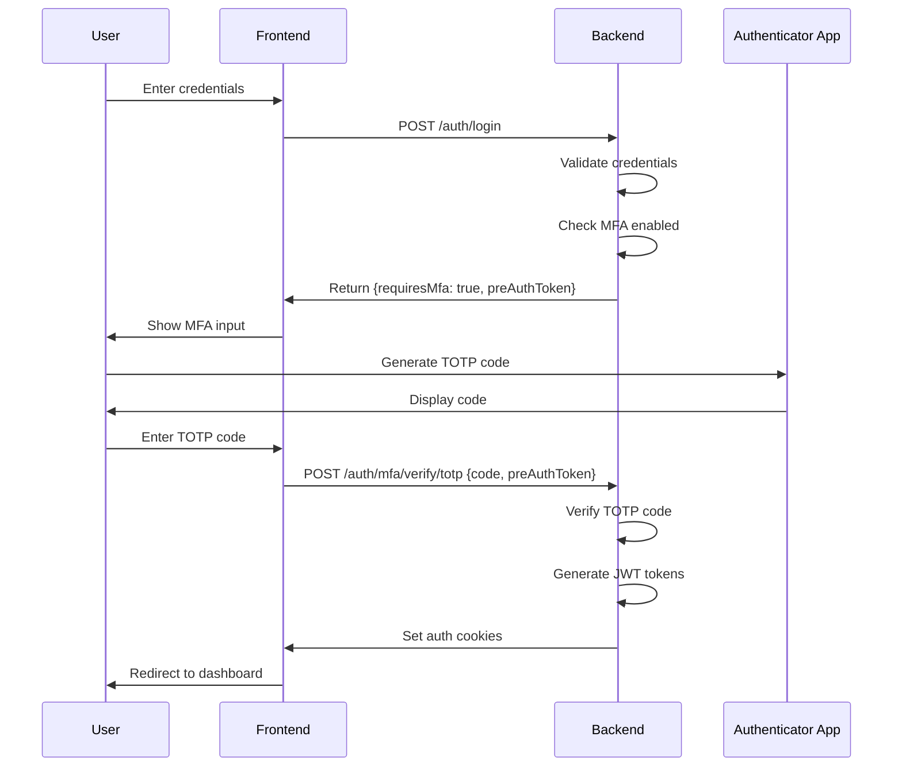
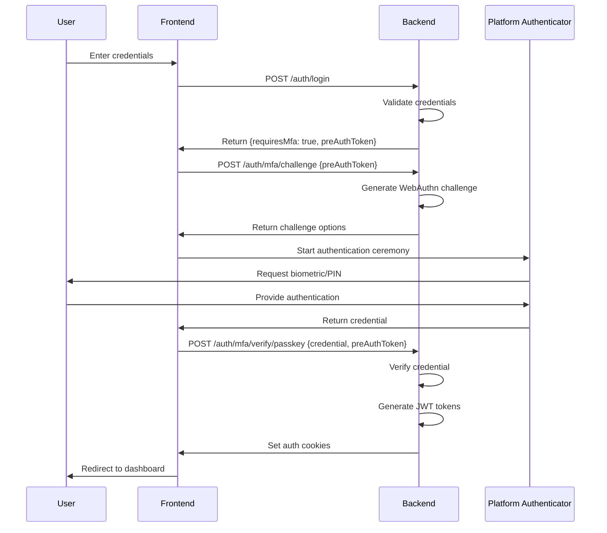
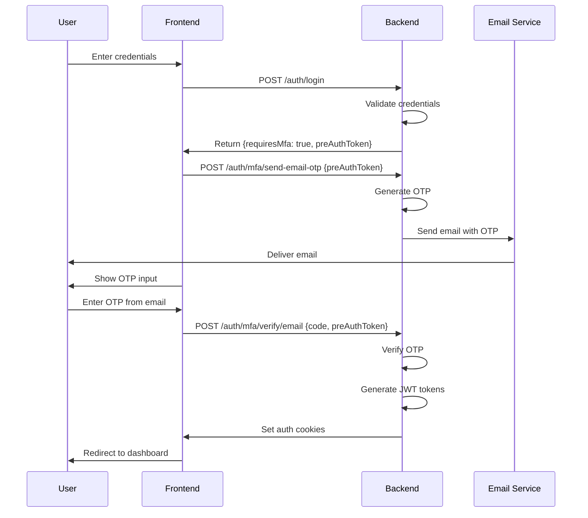
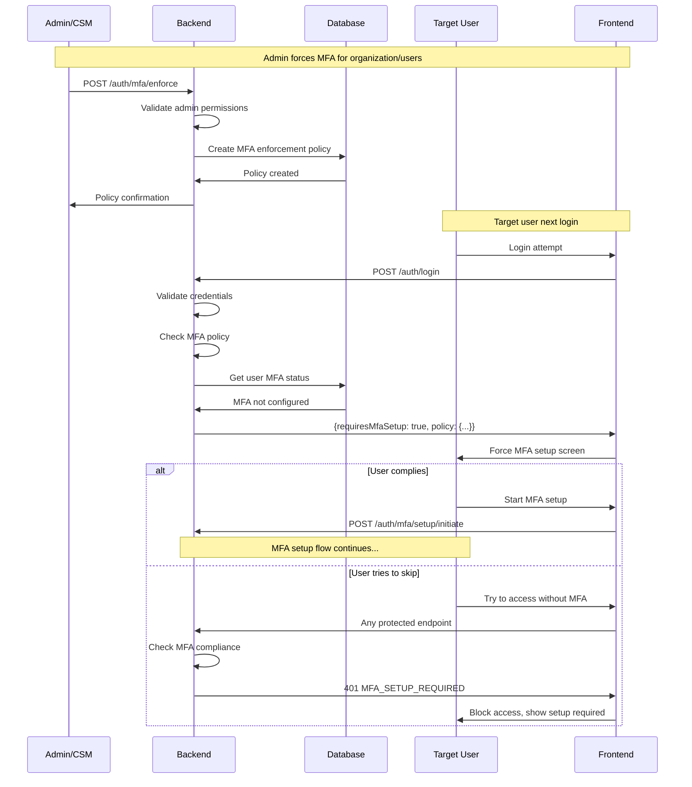

# Multi-Factor Authentication (MFA) Design Document

## 1. Overview

This document outlines the design for implementing Multi-Factor Authentication (MFA) in the KOVR BFF service. The system will support three MFA methods:

1. **Authenticator App (TOTP)** - Time-based One-Time Password using apps like Google Authenticator
2. **PassKey (WebAuthn)** - Hardware/platform authenticators using WebAuthn standard
3. **Email OTP** - One-Time Password sent via email

## 2. Current State Analysis

The current system already has basic MFA infrastructure:
- User entity has `mfa_enabled`, `mfa_type`, and `totp_secret` fields
- Basic MFA guards and strategies exist
- JWT-based authentication is implemented
- Password-based authentication with refresh tokens

## 3. Architecture Overview



## 4. Database Schema Changes

### 4.1 New Entities

#### MfaDevice Entity
```typescript
// src/entities/auth/mfaDevice.entity.ts
import { Entity, PrimaryGeneratedColumn, Column, ManyToOne, JoinColumn, CreateDateColumn, UpdateDateColumn } from 'typeorm';
import { User } from '../user.entity';

export enum MfaDeviceType {
  TOTP = 'TOTP',
  PASSKEY = 'PASSKEY',
  EMAIL = 'EMAIL'
}

export enum MfaDeviceStatus {
  PENDING = 'PENDING',
  ACTIVE = 'ACTIVE',
  DISABLED = 'DISABLED'
}

@Entity('mfa_devices')
export class MfaDevice {
  @PrimaryGeneratedColumn('uuid')
  id: string;

  @Column()
  user_id: string;

  @ManyToOne(() => User, user => user.mfa_devices)
  @JoinColumn({ name: 'user_id' })
  user: User;

  @Column({ type: 'enum', enum: MfaDeviceType })
  type: MfaDeviceType;

  @Column({ type: 'enum', enum: MfaDeviceStatus, default: MfaDeviceStatus.PENDING })
  status: MfaDeviceStatus;

  @Column({ nullable: true })
  name: string; // User-friendly name for the device

  @Column({ nullable: true })
  secret: string; // For TOTP - encrypted

  @Column({ nullable: true })
  credential_id: string; // For PassKey

  @Column({ type: 'text', nullable: true })
  public_key: string; // For PassKey

  @Column({ nullable: true })
  counter: number; // For PassKey

  @Column({ default: false })
  is_primary: boolean;

  @Column({ nullable: true })
  last_used_at: Date;

  @CreateDateColumn()
  created_at: Date;

  @UpdateDateColumn()
  updated_at: Date;
}
```

#### EmailOtp Entity
```typescript
// src/entities/auth/emailOtp.entity.ts
import { Entity, PrimaryGeneratedColumn, Column, ManyToOne, JoinColumn, CreateDateColumn } from 'typeorm';
import { User } from '../user.entity';

@Entity('email_otps')
export class EmailOtp {
  @PrimaryGeneratedColumn('uuid')
  id: string;

  @Column()
  user_id: string;

  @ManyToOne(() => User)
  @JoinColumn({ name: 'user_id' })
  user: User;

  @Column()
  code: string; // Hashed OTP code

  @Column()
  expires_at: Date;

  @Column({ default: false })
  is_used: boolean;

  @Column({ default: 0 })
  attempts: number;

  @Column({ nullable: true })
  purpose: string; // 'LOGIN', 'SETUP', 'RECOVERY'

  @CreateDateColumn()
  created_at: Date;
}
```

#### MfaBackupCode Entity
```typescript
// src/entities/auth/mfaBackupCode.entity.ts
import { Entity, PrimaryGeneratedColumn, Column, ManyToOne, JoinColumn, CreateDateColumn } from 'typeorm';
import { User } from '../user.entity';

@Entity('mfa_backup_codes')
export class MfaBackupCode {
  @PrimaryGeneratedColumn('uuid')
  id: string;

  @Column()
  user_id: string;

  @ManyToOne(() => User)
  @JoinColumn({ name: 'user_id' })
  user: User;

  @Column()
  code_hash: string; // Hashed backup code

  @Column({ default: false })
  is_used: boolean;

  @Column({ nullable: true })
  used_at: Date;

  @CreateDateColumn()
  created_at: Date;
}
```

### 4.2 Updated User Entity

```typescript
// Updates to src/entities/user.entity.ts
export class User {
  // ... existing fields ...

  // Enhanced MFA fields
  @Column({ default: false })
  mfa_enabled: boolean;

  @Column({ type: 'enum', enum: MfaDeviceType, nullable: true })
  primary_mfa_type: MfaDeviceType;

  @OneToMany(() => MfaDevice, device => device.user)
  mfa_devices: MfaDevice[];

  @OneToMany(() => EmailOtp, otp => otp.user)
  email_otps: EmailOtp[];

  @OneToMany(() => MfaBackupCode, code => code.user)
  backup_codes: MfaBackupCode[];

  // Remove old single MFA fields (migrate data first)
  // @Column({ type: 'enum', enum: MfaType, nullable: true })
  // mfa_type: MfaType;
  // 
  // @Column({ nullable: true })
  // totp_secret: string;
  // 
  // @Column({ nullable: true })
  // passkey_credential_id: string;
}
```

## 5. MFA Setup Workflow and State Management

### 5.1 MFA Setup States

```typescript
// src/entities/auth/mfaSetup.entity.ts
export enum MfaSetupStatus {
  NOT_STARTED = 'NOT_STARTED',
  IN_PROGRESS = 'IN_PROGRESS',
  PENDING_VERIFICATION = 'PENDING_VERIFICATION',
  COMPLETED = 'COMPLETED',
  FAILED = 'FAILED',
  EXPIRED = 'EXPIRED'
}

@Entity('mfa_setup_sessions')
export class MfaSetupSession {
  @PrimaryGeneratedColumn('uuid')
  id: string;

  @Column()
  user_id: string;

  @ManyToOne(() => User)
  @JoinColumn({ name: 'user_id' })
  user: User;

  @Column({ type: 'enum', enum: MfaDeviceType })
  device_type: MfaDeviceType;

  @Column({ type: 'enum', enum: MfaSetupStatus, default: MfaSetupStatus.NOT_STARTED })
  status: MfaSetupStatus;

  @Column({ type: 'json', nullable: true })
  setup_data: any; // Store temporary setup data (encrypted)

  @Column({ nullable: true })
  device_name: string;

  @Column()
  expires_at: Date;

  @Column({ default: 0 })
  attempts: number;

  @CreateDateColumn()
  created_at: Date;

  @UpdateDateColumn()
  updated_at: Date;
}
```

### 5.2 MFA Setup State Diagram



### 5.3 Security Policy System

```typescript
// src/entities/auth/securityPolicy.entity.ts
export enum PolicyType {
  MFA_ENFORCEMENT = 'MFA_ENFORCEMENT',
  PASSWORD_POLICY = 'PASSWORD_POLICY',
  SESSION_POLICY = 'SESSION_POLICY',
  ACCESS_CONTROL = 'ACCESS_CONTROL'
}

export enum PolicyScope {
  GLOBAL = 'GLOBAL',
  ORGANIZATION = 'ORGANIZATION',
  ROLE = 'ROLE',
  USER = 'USER'
}

export enum PolicyAction {
  ENFORCE = 'ENFORCE',
  RECOMMEND = 'RECOMMEND',
  DISABLE = 'DISABLE'
}

@Entity('security_policies')
export class SecurityPolicy {
  @PrimaryGeneratedColumn('uuid')
  id: string;

  @Column()
  name: string;

  @Column({ type: 'enum', enum: PolicyType })
  type: PolicyType;

  @Column({ type: 'enum', enum: PolicyScope })
  scope: PolicyScope;

  @Column({ nullable: true })
  scope_id: string; // org_id, role_id, or user_id

  @Column({ type: 'json' })
  rules: any; // Policy-specific rules

  @Column({ type: 'enum', enum: PolicyAction, default: PolicyAction.RECOMMEND })
  action: PolicyAction;

  @Column({ default: true })
  is_active: boolean;

  @Column({ default: 0 })
  priority: number; // Higher priority overrides lower

  @Column()
  created_by: string;

  @ManyToOne(() => User)
  @JoinColumn({ name: 'created_by' })
  creator: User;

  @CreateDateColumn()
  created_at: Date;

  @UpdateDateColumn()
  updated_at: Date;
}

// MFA Enforcement Rules Interface
interface MfaEnforcementRules {
  required: boolean;
  allowed_types: MfaDeviceType[];
  min_devices: number;
  max_devices: number;
  grace_period_days: number;
  bypass_roles: string[];
  enforcement_date?: Date;
}
```

## 6. API Endpoints Design

### 6.1 MFA Controller (Setup and Management)

```typescript
// src/auth/controllers/mfa.controller.ts
@Controller('auth/mfa')
@UseGuards(JwtAuthGuard)
@UseInterceptors(TransformInterceptor)
export class MfaController {
  constructor(
    private readonly mfaService: MfaService,
    private readonly securityPolicyService: SecurityPolicyService,
  ) {}
  
  // === MFA Setup APIs ===
  
  @Get('status')
  @ApiOperation({ summary: 'Get user MFA status and available options' })
  async getMfaStatus(@Request() req) {
    const user = req.user;
    return StandardResponse.success('MFA status retrieved', {
      mfa_enabled: user.mfa_enabled,
      devices: await this.mfaService.getUserDevices(user.id),
      available_types: [MfaDeviceType.TOTP, MfaDeviceType.PASSKEY, MfaDeviceType.EMAIL],
      setup_sessions: await this.mfaService.getActiveSetupSessions(user.id),
      policy: await this.securityPolicyService.getMfaPolicy(user.id),
    });
  }

  @Post('setup/initiate')
  @ApiOperation({ summary: 'Initiate MFA setup process' })
  async initiateMfaSetup(@Request() req, @Body() body: { 
    device_type: MfaDeviceType, 
    device_name: string 
  }) {
    const user = req.user;
    const session = await this.mfaService.initiateMfaSetup(user.id, body.device_type, body.device_name);
    return StandardResponse.success('MFA setup initiated', session);
  }

  @Post('setup/totp/configure')
  @ApiOperation({ summary: 'Configure TOTP device' })
  async configureTotpMfa(@Request() req, @Body() body: { session_id: string }) {
    const user = req.user;
    const result = await this.mfaService.configureTotpDevice(user.id, body.session_id);
    return StandardResponse.success('TOTP configuration ready', result);
  }

  @Post('setup/totp/verify')
  @ApiOperation({ summary: 'Verify and complete TOTP setup' })
  async verifyTotpSetup(@Request() req, @Body() body: { 
    session_id: string, 
    code: string 
  }) {
    const user = req.user;
    const result = await this.mfaService.completeTotpSetup(user.id, body.session_id, body.code);
    return StandardResponse.success('TOTP device configured successfully', result);
  }

  @Post('setup/email/configure')
  @ApiOperation({ summary: 'Configure Email MFA' })
  async configureEmailMfa(@Request() req, @Body() body: { session_id: string }) {
    const user = req.user;
    const result = await this.mfaService.configureEmailDevice(user.id, body.session_id);
    return StandardResponse.success('Email MFA configuration initiated', result);
  }

  @Post('setup/email/verify')
  @ApiOperation({ summary: 'Verify email MFA setup' })
  async verifyEmailSetup(@Request() req, @Body() body: { 
    session_id: string, 
    code: string 
  }) {
    const user = req.user;
    const result = await this.mfaService.completeEmailSetup(user.id, body.session_id, body.code);
    return StandardResponse.success('Email MFA configured successfully', result);
  }

  @Post('setup/passkey/begin')
  @ApiOperation({ summary: 'Begin PassKey registration' })
  async beginPasskeySetup(@Request() req, @Body() body: { session_id: string }) {
    const user = req.user;
    const options = await this.mfaService.beginPasskeySetup(user.id, body.session_id);
    return StandardResponse.success('PassKey registration options generated', options);
  }

  @Post('setup/passkey/complete')
  @ApiOperation({ summary: 'Complete PassKey registration' })
  async completePasskeySetup(@Request() req, @Body() body: { 
    session_id: string, 
    credential: any 
  }) {
    const user = req.user;
    const result = await this.mfaService.completePasskeySetup(user.id, body.session_id, body.credential);
    return StandardResponse.success('PassKey configured successfully', result);
  }

  @Post('setup/cancel')
  @ApiOperation({ summary: 'Cancel MFA setup session' })
  async cancelMfaSetup(@Request() req, @Body() body: { session_id: string }) {
    const user = req.user;
    await this.mfaService.cancelSetupSession(user.id, body.session_id);
    return StandardResponse.success('MFA setup session cancelled');
  }

  @Post('enable')
  @ApiOperation({ summary: 'Enable MFA for user account' })
  async enableMfa(@Request() req, @Body() body: { 
    primary_device_id: string,
    backup_codes?: boolean 
  }) {
    const user = req.user;
    const result = await this.mfaService.enableMfaForUser(user.id, body.primary_device_id, body.backup_codes);
    return StandardResponse.success('MFA enabled successfully', result);
  }

  @Post('disable')
  @ApiOperation({ summary: 'Disable MFA for user account' })
  async disableMfa(@Request() req, @Body() body: { confirmation_code: string }) {
    const user = req.user;
    await this.mfaService.disableMfaForUser(user.id, body.confirmation_code);
    return StandardResponse.success('MFA disabled successfully');
  }

  @Get('devices')
  @ApiOperation({ summary: 'Get user MFA devices' })
  async getUserMfaDevices(@Request() req) {
    const user = req.user;
    const devices = await this.mfaService.getUserDevices(user.id);
    return StandardResponse.success('MFA devices retrieved', devices);
  }

  @Put('device/:deviceId/primary')
  @ApiOperation({ summary: 'Set device as primary MFA method' })
  async setPrimaryMfaDevice(@Request() req, @Param('deviceId') deviceId: string) {
    const user = req.user;
    await this.mfaService.setPrimaryDevice(user.id, deviceId);
    return StandardResponse.success('Primary MFA device updated');
  }

  @Delete('device/:deviceId')
  @ApiOperation({ summary: 'Remove MFA device' })
  async removeMfaDevice(@Request() req, @Param('deviceId') deviceId: string) {
    const user = req.user;
    await this.mfaService.removeDevice(user.id, deviceId);
    return StandardResponse.success('MFA device removed');
  }

  @Post('backup-codes/generate')
  @ApiOperation({ summary: 'Generate backup codes' })
  async generateBackupCodes(@Request() req) {
    const user = req.user;
    const codes = await this.mfaService.generateBackupCodes(user.id);
    return StandardResponse.success('Backup codes generated', { backup_codes: codes });
  }

  // === MFA Enforcement APIs (Admin/CSM Only) ===
  
  @Post('enforce')
  @ApiOperation({ summary: 'Force MFA for users' })
  @Roles(UserRole.OrgAdmin, UserRole.CSM, UserRole.SuperAdmin)
  async enforceMfa(@Request() req, @Body() body: {
    scope: PolicyScope,
    scope_id?: string,
    rules: MfaEnforcementRules,
    target_users?: string[]
  }) {
    const user = req.user;
    const policy = await this.securityPolicyService.createMfaPolicy(user.id, body);
    return StandardResponse.success('MFA enforcement policy created', policy);
  }

  @Get('policies')
  @ApiOperation({ summary: 'Get MFA policies' })
  @Roles(UserRole.OrgAdmin, UserRole.CSM, UserRole.SuperAdmin)
  async getMfaPolicies(@Request() req, @Query() query: {
    scope?: PolicyScope,
    scope_id?: string
  }) {
    const user = req.user;
    const policies = await this.securityPolicyService.getMfaPolicies(user.id, query);
    return StandardResponse.success('MFA policies retrieved', policies);
  }

  @Put('policy/:policyId')
  @ApiOperation({ summary: 'Update MFA policy' })
  @Roles(UserRole.OrgAdmin, UserRole.CSM, UserRole.SuperAdmin)
  async updateMfaPolicy(@Request() req, @Param('policyId') policyId: string, @Body() body: any) {
    const user = req.user;
    const policy = await this.securityPolicyService.updateMfaPolicy(user.id, policyId, body);
    return StandardResponse.success('MFA policy updated', policy);
  }

  @Delete('policy/:policyId')
  @ApiOperation({ summary: 'Delete MFA policy' })
  @Roles(UserRole.OrgAdmin, UserRole.CSM, UserRole.SuperAdmin)
  async deleteMfaPolicy(@Request() req, @Param('policyId') policyId: string) {
    const user = req.user;
    await this.securityPolicyService.deleteMfaPolicy(user.id, policyId);
    return StandardResponse.success('MFA policy deleted');
  }
}
```

### 6.2 Auth Controller (Authentication Verification)

```typescript
// Updates to existing src/auth/auth.controller.ts
@Controller('auth')
export class AuthController {
  
  // === MFA Authentication APIs ===
  
  @Post('mfa/challenge')
  @UseGuards(MfaAuthGuard)
  @ApiOperation({ summary: 'Get MFA challenge' })
  async getMfaChallenge(@Request() req, @Body() body: { device_id?: string }) {
    const user = req.user;
    const challenge = await this.mfaService.generateMfaChallenge(user.id, body.device_id);
    return StandardResponse.success('MFA challenge generated', challenge);
  }

  @Post('mfa/verify/totp')
  @UseGuards(MfaAuthGuard)
  @ApiOperation({ summary: 'Verify TOTP code' })
  async verifyTotpMfa(@Request() req, @Body() body: { code: string, device_id?: string }, @Res({ passthrough: true }) res: Response) {
    const user = req.user;
    const isValid = await this.mfaService.verifyTotpCode(user.id, body.code, body.device_id);
    
    if (isValid) {
      const tokens = await this.authService.generateTokens(user);
      this.setAuthCookies(res, tokens);
      return StandardResponse.success('MFA verification successful');
    }
    
    throw new UnauthorizedException('Invalid MFA code');
  }

  @Post('mfa/verify/email')
  @UseGuards(MfaAuthGuard)
  @ApiOperation({ summary: 'Verify email OTP' })
  async verifyEmailMfa(@Request() req, @Body() body: { code: string }, @Res({ passthrough: true }) res: Response) {
    const user = req.user;
    const isValid = await this.mfaService.verifyEmailOtp(user.id, body.code, 'LOGIN');
    
    if (isValid) {
      const tokens = await this.authService.generateTokens(user);
      this.setAuthCookies(res, tokens);
      return StandardResponse.success('MFA verification successful');
    }
    
    throw new UnauthorizedException('Invalid MFA code');
  }

  @Post('mfa/verify/passkey')
  @UseGuards(MfaAuthGuard)
  @ApiOperation({ summary: 'Verify PassKey' })
  async verifyPasskeyMfa(@Request() req, @Body() body: { credential: any }, @Res({ passthrough: true }) res: Response) {
    const user = req.user;
    const isValid = await this.mfaService.verifyPasskeyCredential(user.id, body.credential);
    
    if (isValid) {
      const tokens = await this.authService.generateTokens(user);
      this.setAuthCookies(res, tokens);
      return StandardResponse.success('MFA verification successful');
    }
    
    throw new UnauthorizedException('Invalid PassKey credential');
  }

  @Post('mfa/verify/backup')
  @UseGuards(MfaAuthGuard)
  @ApiOperation({ summary: 'Verify backup code' })
  async verifyBackupCode(@Request() req, @Body() body: { code: string }, @Res({ passthrough: true }) res: Response) {
    const user = req.user;
    const isValid = await this.mfaService.verifyBackupCode(user.id, body.code);
    
    if (isValid) {
      const tokens = await this.authService.generateTokens(user);
      this.setAuthCookies(res, tokens);
      return StandardResponse.success('MFA verification successful');
    }
    
    throw new UnauthorizedException('Invalid backup code');
  }

  @Post('mfa/send-email-otp')
  @UseGuards(MfaAuthGuard)
  @ApiOperation({ summary: 'Send email OTP for authentication' })
  async sendEmailOtp(@Request() req) {
    const user = req.user;
    await this.mfaService.sendEmailOtp(user.id, 'LOGIN');
    return StandardResponse.success('Email OTP sent successfully');
  }

  // Helper method
  private setAuthCookies(res: Response, tokens: { accessToken: string, refreshToken: string }) {
    res.cookie('access_token', tokens.accessToken, {
      httpOnly: true,
      secure: true,
      sameSite: 'strict',
      maxAge: 15 * 60 * 1000 // 15 minutes
    });

    res.cookie('refresh_token', tokens.refreshToken, {
      httpOnly: true,
      secure: true,
      sameSite: 'strict',
      maxAge: 7 * 24 * 60 * 60 * 1000 // 7 days
    });
  }
}
```

## 7. MFA Setup Workflow Diagrams

### 7.1 Complete MFA Setup Flow



### 7.2 MFA Selection and Fallback Strategy



### 7.3 Incomplete Setup Recovery Flow



## 8. Service Layer Implementation

### 8.1 Enhanced MFA Service

```typescript
// src/auth/services/mfa.service.ts
@Injectable()
export class MfaService {
  constructor(
    @InjectRepository(MfaDevice) private mfaDeviceRepo: Repository<MfaDevice>,
    @InjectRepository(MfaSetupSession) private setupSessionRepo: Repository<MfaSetupSession>,
    @InjectRepository(EmailOtp) private emailOtpRepo: Repository<EmailOtp>,
    @InjectRepository(MfaBackupCode) private backupCodeRepo: Repository<MfaBackupCode>,
    @InjectRepository(User) private userRepo: Repository<User>,
    private emailService: EmailService,
    private configService: ConfigService,
    private cacheService: CacheService, // For storing temporary data
  ) {}

  // === MFA Setup Session Management ===

  async initiateMfaSetup(userId: string, deviceType: MfaDeviceType, deviceName: string): Promise<any> {
    // Cancel any existing incomplete sessions for this device type
    await this.setupSessionRepo.update(
      { 
        user_id: userId, 
        device_type: deviceType, 
        status: In([MfaSetupStatus.IN_PROGRESS, MfaSetupStatus.PENDING_VERIFICATION])
      },
      { status: MfaSetupStatus.EXPIRED }
    );

    const session = this.setupSessionRepo.create({
      user_id: userId,
      device_type: deviceType,
      device_name: deviceName,
      status: MfaSetupStatus.IN_PROGRESS,
      expires_at: new Date(Date.now() + 30 * 60 * 1000), // 30 minutes
    });

    const savedSession = await this.setupSessionRepo.save(session);

    return {
      session_id: savedSession.id,
      device_type: deviceType,
      device_name: deviceName,
      expires_at: savedSession.expires_at,
    };
  }

  async getActiveSetupSessions(userId: string): Promise<MfaSetupSession[]> {
    return await this.setupSessionRepo.find({
      where: {
        user_id: userId,
        status: In([MfaSetupStatus.IN_PROGRESS, MfaSetupStatus.PENDING_VERIFICATION]),
        expires_at: MoreThan(new Date()),
      },
      order: { created_at: 'DESC' },
    });
  }

  async cancelSetupSession(userId: string, sessionId: string): Promise<void> {
    await this.setupSessionRepo.update(
      { id: sessionId, user_id: userId },
      { status: MfaSetupStatus.FAILED }
    );
  }

  // === TOTP Setup Methods ===

  async configureTotpDevice(userId: string, sessionId: string): Promise<any> {
    const session = await this.validateSetupSession(userId, sessionId, MfaDeviceType.TOTP);
    const user = await this.userRepo.findOne({ where: { id: userId } });
    
    const secret = speakeasy.generateSecret({
      name: `KOVR (${user.email})`,
      issuer: this.configService.get('MFA_TOTP_ISSUER', 'KOVR'),
    });

    // Store encrypted secret in session
    session.setup_data = {
      secret: await this.encryptSecret(secret.base32),
      qrCode: secret.otpauth_url,
    };
    session.status = MfaSetupStatus.PENDING_VERIFICATION;
    await this.setupSessionRepo.save(session);

    return {
      qr_code: secret.otpauth_url,
      manual_entry_key: secret.base32,
      session_id: sessionId,
    };
  }

  async completeTotpSetup(userId: string, sessionId: string, code: string): Promise<any> {
    const session = await this.validateSetupSession(userId, sessionId, MfaDeviceType.TOTP);
    
    if (session.status !== MfaSetupStatus.PENDING_VERIFICATION) {
      throw new BadRequestException('Setup session not ready for verification');
    }

    const secret = await this.decryptSecret(session.setup_data.secret);
    const verified = speakeasy.totp.verify({
      secret,
      encoding: 'base32',
      token: code,
      window: 1,
    });

    if (!verified) {
      session.attempts += 1;
      if (session.attempts >= 3) {
        session.status = MfaSetupStatus.FAILED;
      }
      await this.setupSessionRepo.save(session);
      throw new BadRequestException('Invalid TOTP code');
    }

    // Create the MFA device
    const device = this.mfaDeviceRepo.create({
      user_id: userId,
      type: MfaDeviceType.TOTP,
      name: session.device_name,
      secret: session.setup_data.secret, // Already encrypted
      status: MfaDeviceStatus.ACTIVE,
    });

    await this.mfaDeviceRepo.save(device);
    
    // Mark session as completed
    session.status = MfaSetupStatus.COMPLETED;
    await this.setupSessionRepo.save(session);

    return {
      device_id: device.id,
      device_name: device.name,
      device_type: device.type,
      message: 'TOTP device configured successfully',
    };
  }

  // === Email OTP Setup Methods ===

  async configureEmailDevice(userId: string, sessionId: string): Promise<any> {
    const session = await this.validateSetupSession(userId, sessionId, MfaDeviceType.EMAIL);
    const user = await this.userRepo.findOne({ where: { id: userId } });
    
    // Send verification email
    await this.sendEmailOtp(userId, 'SETUP');
    
    session.status = MfaSetupStatus.PENDING_VERIFICATION;
    await this.setupSessionRepo.save(session);

    return {
      message: `Verification code sent to ${user.email}`,
      session_id: sessionId,
    };
  }

  async completeEmailSetup(userId: string, sessionId: string, code: string): Promise<any> {
    const session = await this.validateSetupSession(userId, sessionId, MfaDeviceType.EMAIL);
    
    const isValid = await this.verifyEmailOtp(userId, code, 'SETUP');
    
    if (!isValid) {
      session.attempts += 1;
      if (session.attempts >= 3) {
        session.status = MfaSetupStatus.FAILED;
      }
      await this.setupSessionRepo.save(session);
      throw new BadRequestException('Invalid email verification code');
    }

    // Create the MFA device
    const device = this.mfaDeviceRepo.create({
      user_id: userId,
      type: MfaDeviceType.EMAIL,
      name: session.device_name,
      status: MfaDeviceStatus.ACTIVE,
    });

    await this.mfaDeviceRepo.save(device);
    
    session.status = MfaSetupStatus.COMPLETED;
    await this.setupSessionRepo.save(session);

    return {
      device_id: device.id,
      device_name: device.name,
      device_type: device.type,
      message: 'Email MFA configured successfully',
    };
  }

  // === PassKey Setup Methods ===

  async beginPasskeySetup(userId: string, sessionId: string): Promise<any> {
    const session = await this.validateSetupSession(userId, sessionId, MfaDeviceType.PASSKEY);
    const user = await this.userRepo.findOne({ where: { id: userId } });
    
    // Get existing credentials to exclude
    const existingDevices = await this.mfaDeviceRepo.find({
      where: { user_id: userId, type: MfaDeviceType.PASSKEY, status: MfaDeviceStatus.ACTIVE },
    });

    const excludeCredentials = existingDevices.map(device => ({
      id: device.credential_id,
      type: 'public-key',
    }));

    const options = await generateRegistrationOptions({
      rpName: this.configService.get('WEBAUTHN_RP_NAME', 'KOVR'),
      rpID: this.configService.get('WEBAUTHN_RP_ID'),
      userID: userId,
      userName: user.email,
      userDisplayName: user.name,
      attestationType: 'none',
      excludeCredentials,
      authenticatorSelection: {
        residentKey: 'discouraged',
        userVerification: 'preferred',
      },
    });

    // Store challenge in session
    session.setup_data = {
      challenge: options.challenge,
    };
    session.status = MfaSetupStatus.PENDING_VERIFICATION;
    await this.setupSessionRepo.save(session);

    return options;
  }

  async completePasskeySetup(userId: string, sessionId: string, credential: any): Promise<any> {
    const session = await this.validateSetupSession(userId, sessionId, MfaDeviceType.PASSKEY);
    
    const verification = await verifyRegistrationResponse({
      response: credential,
      expectedChallenge: session.setup_data.challenge,
      expectedOrigin: this.configService.get('WEBAUTHN_ORIGIN'),
      expectedRPID: this.configService.get('WEBAUTHN_RP_ID'),
    });

    if (!verification.verified) {
      session.attempts += 1;
      if (session.attempts >= 3) {
        session.status = MfaSetupStatus.FAILED;
      }
      await this.setupSessionRepo.save(session);
      throw new BadRequestException('PassKey verification failed');
    }

    // Create the MFA device
    const device = this.mfaDeviceRepo.create({
      user_id: userId,
      type: MfaDeviceType.PASSKEY,
      name: session.device_name,
      credential_id: credential.id,
      public_key: Buffer.from(verification.registrationInfo.credentialPublicKey).toString('base64'),
      counter: verification.registrationInfo.counter,
      status: MfaDeviceStatus.ACTIVE,
    });

    await this.mfaDeviceRepo.save(device);
    
    session.status = MfaSetupStatus.COMPLETED;
    await this.setupSessionRepo.save(session);

    return {
      device_id: device.id,
      device_name: device.name,
      device_type: device.type,
      message: 'PassKey configured successfully',
    };
  }

  // === MFA Management ===

  async enableMfaForUser(userId: string, primaryDeviceId: string, generateBackupCodes: boolean = true): Promise<any> {
    const device = await this.mfaDeviceRepo.findOne({
      where: { id: primaryDeviceId, user_id: userId, status: MfaDeviceStatus.ACTIVE },
    });

    if (!device) {
      throw new BadRequestException('Invalid device');
    }

    // Set as primary device
    await this.mfaDeviceRepo.update(
      { user_id: userId, is_primary: true },
      { is_primary: false }
    );
    
    device.is_primary = true;
    await this.mfaDeviceRepo.save(device);

    // Enable MFA for user
    await this.userRepo.update(userId, { 
      mfa_enabled: true,
      primary_mfa_type: device.type,
    });

    let backupCodes = [];
    if (generateBackupCodes) {
      backupCodes = await this.generateBackupCodes(userId);
    }

    return {
      message: 'MFA enabled successfully',
      primary_device: device,
      backup_codes: backupCodes,
    };
  }

  async getUserDevices(userId: string): Promise<any[]> {
    const devices = await this.mfaDeviceRepo.find({
      where: { user_id: userId, status: MfaDeviceStatus.ACTIVE },
      order: { is_primary: 'DESC', created_at: 'ASC' },
    });

    return devices.map(device => ({
      id: device.id,
      name: device.name,
      type: device.type,
      is_primary: device.is_primary,
      last_used_at: device.last_used_at,
      created_at: device.created_at,
    }));
  }

  async setPrimaryDevice(userId: string, deviceId: string): Promise<void> {
    const device = await this.mfaDeviceRepo.findOne({
      where: { id: deviceId, user_id: userId, status: MfaDeviceStatus.ACTIVE },
    });

    if (!device) {
      throw new BadRequestException('Device not found');
    }

    // Remove primary flag from other devices
    await this.mfaDeviceRepo.update(
      { user_id: userId, is_primary: true },
      { is_primary: false }
    );

    // Set new primary device
    device.is_primary = true;
    await this.mfaDeviceRepo.save(device);

    // Update user's primary MFA type
    await this.userRepo.update(userId, { primary_mfa_type: device.type });
  }

  // === Helper Methods ===

  private async validateSetupSession(userId: string, sessionId: string, expectedType: MfaDeviceType): Promise<MfaSetupSession> {
    const session = await this.setupSessionRepo.findOne({
      where: { 
        id: sessionId, 
        user_id: userId, 
        device_type: expectedType,
        expires_at: MoreThan(new Date()),
      },
    });

    if (!session) {
      throw new BadRequestException('Invalid or expired setup session');
    }

    if (session.status === MfaSetupStatus.COMPLETED) {
      throw new BadRequestException('Setup already completed');
    }

    if (session.status === MfaSetupStatus.FAILED) {
      throw new BadRequestException('Setup failed - please start over');
    }

    return session;
  }

  // ... rest of existing methods (TOTP verification, Email OTP, etc.)
}
```

### 8.2 Security Policy Service

```typescript
// src/auth/services/securityPolicy.service.ts
@Injectable()
export class SecurityPolicyService {
  constructor(
    @InjectRepository(SecurityPolicy) private policyRepo: Repository<SecurityPolicy>,
    @InjectRepository(User) private userRepo: Repository<User>,
    private loggerService: LoggerService,
  ) {}

  async createMfaPolicy(createdBy: string, policyData: {
    scope: PolicyScope,
    scope_id?: string,
    rules: MfaEnforcementRules,
    target_users?: string[]
  }): Promise<SecurityPolicy> {
    const creator = await this.userRepo.findOne({ 
      where: { id: createdBy },
      relations: ['role', 'customer']
    });

    // Validate permissions
    await this.validatePolicyPermissions(creator, policyData.scope, policyData.scope_id);

    const policy = this.policyRepo.create({
      name: `MFA Enforcement - ${policyData.scope}`,
      type: PolicyType.MFA_ENFORCEMENT,
      scope: policyData.scope,
      scope_id: policyData.scope_id,
      rules: policyData.rules,
      action: PolicyAction.ENFORCE,
      created_by: createdBy,
      priority: await this.calculatePriority(policyData.scope),
    });

    const savedPolicy = await this.policyRepo.save(policy);

    // If targeting specific users, create individual policies
    if (policyData.target_users?.length > 0) {
      await this.createUserSpecificPolicies(createdBy, policyData.target_users, policyData.rules);
    }

    await this.loggerService.log('MFA_POLICY_CREATED', {
      policy_id: savedPolicy.id,
      created_by: createdBy,
      scope: policyData.scope,
      scope_id: policyData.scope_id,
    });

    return savedPolicy;
  }

  async getMfaPolicy(userId: string): Promise<any> {
    const user = await this.userRepo.findOne({
      where: { id: userId },
      relations: ['role', 'customer']
    });

    // Get applicable policies in order of priority
    const policies = await this.policyRepo.find({
      where: [
        // User-specific policy (highest priority)
        { type: PolicyType.MFA_ENFORCEMENT, scope: PolicyScope.USER, scope_id: userId, is_active: true },
        // Role-specific policy
        { type: PolicyType.MFA_ENFORCEMENT, scope: PolicyScope.ROLE, scope_id: user.role_id.toString(), is_active: true },
        // Organization policy
        { type: PolicyType.MFA_ENFORCEMENT, scope: PolicyScope.ORGANIZATION, scope_id: user.customer_id, is_active: true },
        // Global policy (lowest priority)
        { type: PolicyType.MFA_ENFORCEMENT, scope: PolicyScope.GLOBAL, is_active: true },
      ],
      order: { priority: 'DESC', created_at: 'DESC' },
    });

    // Return the highest priority applicable policy
    const applicablePolicy = policies[0];
    
    if (!applicablePolicy) {
      return {
        mfa_required: false,
        policy: null,
      };
    }

    const rules = applicablePolicy.rules as MfaEnforcementRules;
    
    return {
      mfa_required: rules.required,
      rules,
      policy_id: applicablePolicy.id,
      enforcement_level: applicablePolicy.scope,
      grace_period_ends: this.calculateGracePeriodEnd(applicablePolicy),
    };
  }

  async getMfaPolicies(requesterId: string, filters: {
    scope?: PolicyScope,
    scope_id?: string
  }): Promise<SecurityPolicy[]> {
    const requester = await this.userRepo.findOne({
      where: { id: requesterId },
      relations: ['role', 'customer']
    });

    let whereConditions: any = {
      type: PolicyType.MFA_ENFORCEMENT,
      is_active: true,
    };

    // Apply scope filtering based on user permissions
    if (requester.role_id === UserRole.SuperAdmin) {
      // Super admin can see all policies
      if (filters.scope) whereConditions.scope = filters.scope;
      if (filters.scope_id) whereConditions.scope_id = filters.scope_id;
    } else if (requester.role_id === UserRole.CSM) {
      // CSM can see global and organization policies they manage
      whereConditions = [
        { ...whereConditions, scope: PolicyScope.GLOBAL },
        { ...whereConditions, scope: PolicyScope.ORGANIZATION, scope_id: In(await this.getCsmOrganizations(requesterId)) },
      ];
    } else if (requester.role_id === UserRole.OrgAdmin) {
      // Org admin can only see their organization's policies
      whereConditions.scope_id = requester.customer_id;
    } else {
      throw new ForbiddenException('Insufficient permissions to view policies');
    }

    return await this.policyRepo.find({
      where: whereConditions,
      relations: ['creator'],
      order: { priority: 'DESC', created_at: 'DESC' },
    });
  }

  async updateMfaPolicy(requesterId: string, policyId: string, updates: Partial<SecurityPolicy>): Promise<SecurityPolicy> {
    const policy = await this.policyRepo.findOne({
      where: { id: policyId },
      relations: ['creator'],
    });

    if (!policy) {
      throw new NotFoundException('Policy not found');
    }

    const requester = await this.userRepo.findOne({
      where: { id: requesterId },
      relations: ['role', 'customer']
    });

    await this.validatePolicyPermissions(requester, policy.scope, policy.scope_id);

    // Update allowed fields
    if (updates.rules) policy.rules = updates.rules;
    if (updates.is_active !== undefined) policy.is_active = updates.is_active;
    if (updates.action) policy.action = updates.action;

    const updatedPolicy = await this.policyRepo.save(policy);

    await this.loggerService.log('MFA_POLICY_UPDATED', {
      policy_id: policyId,
      updated_by: requesterId,
      changes: updates,
    });

    return updatedPolicy;
  }

  async deleteMfaPolicy(requesterId: string, policyId: string): Promise<void> {
    const policy = await this.policyRepo.findOne({ where: { id: policyId } });

    if (!policy) {
      throw new NotFoundException('Policy not found');
    }

    const requester = await this.userRepo.findOne({
      where: { id: requesterId },
      relations: ['role', 'customer']
    });

    await this.validatePolicyPermissions(requester, policy.scope, policy.scope_id);

    // Soft delete by marking as inactive
    policy.is_active = false;
    await this.policyRepo.save(policy);

    await this.loggerService.log('MFA_POLICY_DELETED', {
      policy_id: policyId,
      deleted_by: requesterId,
    });
  }

  // Check if user needs to complete MFA setup
  async checkMfaRequirement(userId: string): Promise<{
    mfa_required: boolean,
    user_compliant: boolean,
    grace_period_remaining: number | null,
    required_actions: string[]
  }> {
    const policy = await this.getMfaPolicy(userId);
    
    if (!policy.mfa_required) {
      return {
        mfa_required: false,
        user_compliant: true,
        grace_period_remaining: null,
        required_actions: [],
      };
    }

    const user = await this.userRepo.findOne({
      where: { id: userId },
      relations: ['mfa_devices'],
    });

    const activeDevices = user.mfa_devices?.filter(d => d.status === MfaDeviceStatus.ACTIVE) || [];
    const rules = policy.rules as MfaEnforcementRules;
    
    const requiredActions = [];
    let userCompliant = true;

    // Check if user has MFA enabled
    if (!user.mfa_enabled) {
      userCompliant = false;
      requiredActions.push('Enable MFA on your account');
    }

    // Check minimum devices requirement
    if (activeDevices.length < rules.min_devices) {
      userCompliant = false;
      requiredActions.push(`Configure at least ${rules.min_devices} MFA device(s)`);
    }

    // Check allowed device types
    const userDeviceTypes = activeDevices.map(d => d.type);
    const hasAllowedType = rules.allowed_types.some(type => userDeviceTypes.includes(type));
    
    if (activeDevices.length > 0 && !hasAllowedType) {
      userCompliant = false;
      requiredActions.push(`Configure one of these MFA types: ${rules.allowed_types.join(', ')}`);
    }

    // Calculate grace period remaining
    let gracePeriodRemaining = null;
    if (policy.grace_period_ends) {
      const now = new Date();
      const graceEnd = new Date(policy.grace_period_ends);
      gracePeriodRemaining = Math.max(0, Math.ceil((graceEnd.getTime() - now.getTime()) / (1000 * 60 * 60 * 24)));
    }

    return {
      mfa_required: true,
      user_compliant: userCompliant,
      grace_period_remaining: gracePeriodRemaining,
      required_actions: requiredActions,
    };
  }

  // Private helper methods
  private async validatePolicyPermissions(user: User, scope: PolicyScope, scopeId?: string): Promise<void> {
    switch (user.role_id) {
      case UserRole.SuperAdmin:
        // Super admin can manage all policies
        return;
        
      case UserRole.CSM:
        // CSM can manage global and organization policies for their customers
        if (scope === PolicyScope.GLOBAL) return;
        if (scope === PolicyScope.ORGANIZATION) {
          const managedOrgs = await this.getCsmOrganizations(user.id);
          if (managedOrgs.includes(scopeId)) return;
        }
        break;
        
      case UserRole.OrgAdmin:
        // Org admin can only manage their organization's policies
        if (scope === PolicyScope.ORGANIZATION && scopeId === user.customer_id) return;
        if (scope === PolicyScope.ROLE && scopeId) {
          // Can manage role policies within their organization
          return;
        }
        if (scope === PolicyScope.USER && scopeId) {
          // Can manage user policies within their organization
          const targetUser = await this.userRepo.findOne({ where: { id: scopeId } });
          if (targetUser && targetUser.customer_id === user.customer_id) return;
        }
        break;
    }
    
    throw new ForbiddenException('Insufficient permissions to manage this policy');
  }

  private async calculatePriority(scope: PolicyScope): Promise<number> {
    const basePriorities = {
      [PolicyScope.USER]: 1000,
      [PolicyScope.ROLE]: 800,
      [PolicyScope.ORGANIZATION]: 600,
      [PolicyScope.GLOBAL]: 400,
    };
    
    return basePriorities[scope];
  }

  private async createUserSpecificPolicies(createdBy: string, userIds: string[], rules: MfaEnforcementRules): Promise<void> {
    const userPolicies = userIds.map(userId => 
      this.policyRepo.create({
        name: `MFA Enforcement - User Specific`,
        type: PolicyType.MFA_ENFORCEMENT,
        scope: PolicyScope.USER,
        scope_id: userId,
        rules,
        action: PolicyAction.ENFORCE,
        created_by: createdBy,
        priority: 1000,
      })
    );

    await this.policyRepo.save(userPolicies);
  }

  private calculateGracePeriodEnd(policy: SecurityPolicy): Date | null {{
    const rules = policy.rules as MfaEnforcementRules;
    if (!rules.grace_period_days) return null;
    
    const enforcementDate = rules.enforcement_date ? new Date(rules.enforcement_date) : policy.created_at;
    return new Date(enforcementDate.getTime() + (rules.grace_period_days * 24 * 60 * 60 * 1000));
  }

  private async getCsmOrganizations(csmId: string): Promise<string[]> {
    // Implementation to get organizations managed by CSM
    // This would involve querying the CustomerCsm entity
    return []; // Placeholder
  }
}
```

```typescript
// src/auth/services/mfa.service.ts
@Injectable()
export class MfaService {
  constructor(
    @InjectRepository(MfaDevice) private mfaDeviceRepo: Repository<MfaDevice>,
    @InjectRepository(EmailOtp) private emailOtpRepo: Repository<EmailOtp>,
    @InjectRepository(MfaBackupCode) private backupCodeRepo: Repository<MfaBackupCode>,
    private emailService: EmailService,
    private configService: ConfigService,
  ) {}

  // TOTP Methods
  async setupTotpDevice(userId: string): Promise<{ secret: string; qrCode: string }> {
    const secret = speakeasy.generateSecret({
      name: `KOVR (${user.email})`,
      issuer: 'KOVR',
    });

    const device = this.mfaDeviceRepo.create({
      user_id: userId,
      type: MfaDeviceType.TOTP,
      secret: await this.encryptSecret(secret.base32),
      status: MfaDeviceStatus.PENDING,
    });

    await this.mfaDeviceRepo.save(device);

    return {
      secret: secret.base32,
      qrCode: secret.otpauth_url,
    };
  }

  async verifyTotpCode(userId: string, code: string, deviceId?: string): Promise<boolean> {
    const device = await this.mfaDeviceRepo.findOne({
      where: { 
        user_id: userId, 
        type: MfaDeviceType.TOTP,
        ...(deviceId && { id: deviceId }),
        status: In([MfaDeviceStatus.PENDING, MfaDeviceStatus.ACTIVE])
      },
    });

    if (!device) return false;

    const secret = await this.decryptSecret(device.secret);
    const verified = speakeasy.totp.verify({
      secret,
      encoding: 'base32',
      token: code,
      window: 1, // Allow 1 step tolerance
    });

    if (verified) {
      await this.updateDeviceLastUsed(device.id);
      if (device.status === MfaDeviceStatus.PENDING) {
        device.status = MfaDeviceStatus.ACTIVE;
        await this.mfaDeviceRepo.save(device);
      }
    }

    return verified;
  }

  // Email OTP Methods
  async sendEmailOtp(userId: string, purpose: string = 'LOGIN'): Promise<void> {
    const user = await this.getUserById(userId);
    const code = this.generateOtpCode();
    const hashedCode = await bcrypt.hash(code, 10);

    // Invalidate previous OTPs
    await this.emailOtpRepo.update(
      { user_id: userId, purpose, is_used: false },
      { is_used: true }
    );

    const emailOtp = this.emailOtpRepo.create({
      user_id: userId,
      code: hashedCode,
      purpose,
      expires_at: new Date(Date.now() + 10 * 60 * 1000), // 10 minutes
    });

    await this.emailOtpRepo.save(emailOtp);

    // Send email
    await this.emailService.sendMfaOtpEmail(user.email, code);
  }

  async verifyEmailOtp(userId: string, code: string, purpose: string = 'LOGIN'): Promise<boolean> {
    const otpRecord = await this.emailOtpRepo.findOne({
      where: {
        user_id: userId,
        purpose,
        is_used: false,
        expires_at: MoreThan(new Date()),
      },
      order: { created_at: 'DESC' },
    });

    if (!otpRecord) return false;

    // Check attempt limits
    if (otpRecord.attempts >= 3) {
      otpRecord.is_used = true;
      await this.emailOtpRepo.save(otpRecord);
      return false;
    }

    const isValid = await bcrypt.compare(code, otpRecord.code);
    otpRecord.attempts += 1;

    if (isValid) {
      otpRecord.is_used = true;
    }

    await this.emailOtpRepo.save(otpRecord);
    return isValid;
  }

  // PassKey Methods
  async generatePasskeyRegistrationOptions(userId: string): Promise<any> {
    const user = await this.getUserById(userId);
    
    const options = await generateRegistrationOptions({
      rpName: 'KOVR',
      rpID: this.configService.get('WEBAUTHN_RP_ID'),
      userID: userId,
      userName: user.email,
      userDisplayName: user.name,
      attestationType: 'none',
      excludeCredentials: [], // TODO: Get existing credentials
      authenticatorSelection: {
        residentKey: 'discouraged',
        userVerification: 'preferred',
      },
    });

    // Store challenge temporarily (Redis or in-memory cache)
    await this.storeChallenge(userId, options.challenge);

    return options;
  }

  async verifyPasskeyRegistration(userId: string, credential: any, name: string): Promise<boolean> {
    const expectedChallenge = await this.getStoredChallenge(userId);
    
    const verification = await verifyRegistrationResponse({
      response: credential,
      expectedChallenge,
      expectedOrigin: this.configService.get('WEBAUTHN_ORIGIN'),
      expectedRPID: this.configService.get('WEBAUTHN_RP_ID'),
    });

    if (verification.verified) {
      const device = this.mfaDeviceRepo.create({
        user_id: userId,
        type: MfaDeviceType.PASSKEY,
        name,
        credential_id: credential.id,
        public_key: verification.registrationInfo.credentialPublicKey,
        counter: verification.registrationInfo.counter,
        status: MfaDeviceStatus.ACTIVE,
      });

      await this.mfaDeviceRepo.save(device);
    }

    return verification.verified;
  }

  // Backup Codes
  async generateBackupCodes(userId: string): Promise<string[]> {
    // Invalidate existing codes
    await this.backupCodeRepo.update(
      { user_id: userId, is_used: false },
      { is_used: true }
    );

    const codes = Array.from({ length: 10 }, () => 
      Math.random().toString(36).substring(2, 10).toUpperCase()
    );

    const backupCodes = codes.map(code => 
      this.backupCodeRepo.create({
        user_id: userId,
        code_hash: bcrypt.hashSync(code, 10),
      })
    );

    await this.backupCodeRepo.save(backupCodes);
    return codes;
  }

  async verifyBackupCode(userId: string, code: string): Promise<boolean> {
    const backupCodes = await this.backupCodeRepo.find({
      where: { user_id: userId, is_used: false },
    });

    for (const backupCode of backupCodes) {
      if (bcrypt.compareSync(code, backupCode.code_hash)) {
        backupCode.is_used = true;
        backupCode.used_at = new Date();
        await this.backupCodeRepo.save(backupCode);
        return true;
      }
    }

    return false;
  }

  // Helper methods
  private generateOtpCode(): string {
    return Math.floor(100000 + Math.random() * 900000).toString();
  }

  private async encryptSecret(secret: string): Promise<string> {
    // Implement encryption logic
    return secret; // Placeholder
  }

  private async decryptSecret(encryptedSecret: string): Promise<string> {
    // Implement decryption logic
    return encryptedSecret; // Placeholder
  }
}
```

## 9. Email OTP as Universal Fallback

### 9.1 Fallback Strategy Implementation

Email OTP serves as the universal fallback for all MFA types:

1. **When primary MFA device is unavailable**
2. **When user loses access to their primary device**
3. **For account recovery scenarios**
4. **As a backup during device setup**

```typescript
// Enhanced MFA Challenge Logic
async generateMfaChallenge(userId: string, deviceId?: string): Promise<any> {
  const user = await this.userRepo.findOne({
    where: { id: userId },
    relations: ['mfa_devices'],
  });

  const activeDevices = user.mfa_devices.filter(d => d.status === MfaDeviceStatus.ACTIVE);
  
  if (deviceId) {
    const selectedDevice = activeDevices.find(d => d.id === deviceId);
    if (selectedDevice) {
      return this.generateDeviceChallenge(selectedDevice);
    }
  }

  // Get primary device
  const primaryDevice = activeDevices.find(d => d.is_primary);
  
  return {
    primary_device: primaryDevice ? {
      id: primaryDevice.id,
      name: primaryDevice.name,
      type: primaryDevice.type,
    } : null,
    alternative_devices: activeDevices.filter(d => !d.is_primary).map(d => ({
      id: d.id,
      name: d.name,
      type: d.type,
    })),
    fallback_options: [
      {
        type: 'EMAIL_OTP',
        name: 'Email Verification',
        description: 'Send verification code to your email',
      },
      {
        type: 'BACKUP_CODE',
        name: 'Backup Code',
        description: 'Use one of your backup codes',
      }
    ],
    email_masked: this.maskEmail(user.email),
  };
}
```

### 9.2 Enhanced Authentication Guard

```typescript
// src/auth/guards/enhanced-mfa-auth.guard.ts
@Injectable()
export class EnhancedMfaAuthGuard implements CanActivate {
  constructor(
    private mfaService: MfaService,
    private securityPolicyService: SecurityPolicyService,
  ) {}

  async canActivate(context: ExecutionContext): Promise<boolean> {
    const request = context.switchToHttp().getRequest();
    const user = request.user;

    if (!user) return false;

    // Check if MFA is required by policy
    const mfaRequirement = await this.securityPolicyService.checkMfaRequirement(user.id);
    
    if (!mfaRequirement.mfa_required) {
      return true; // No MFA required
    }

    if (!mfaRequirement.user_compliant) {
      // Force MFA setup
      throw new UnauthorizedException({
        error: 'MFA_SETUP_REQUIRED',
        message: 'Multi-factor authentication setup is required',
        required_actions: mfaRequirement.required_actions,
        grace_period_remaining: mfaRequirement.grace_period_remaining,
      });
    }

    // Check if user has completed first factor
    const authToken = request.headers.authorization?.replace('Bearer ', '');
    if (!authToken || !this.isPreAuthToken(authToken)) {
      throw new UnauthorizedException({
        error: 'PRE_AUTH_REQUIRED',
        message: 'First factor authentication required',
      });
    }

    return true;
  }

  private isPreAuthToken(token: string): boolean {
    // Verify if token is a pre-auth token
    try {
      const decoded = jwt.verify(token, process.env.JWT_SECRET) as any;
      return decoded.type === 'pre-auth';
    } catch {
      return false;
    }
  }
}
```

## 10. Authentication Flow Sequences

### 10.1 TOTP Authentication Flow



### 10.2 PassKey Authentication Flow



### 10.3 Email OTP Authentication Flow



### 10.4 Force MFA Enforcement Flow



## 11. Security Considerations

### 11.1 Rate Limiting
- Implement rate limiting on MFA verification attempts
- Block IP addresses after multiple failed attempts
- Implement progressive delays for failed attempts

### 11.2 Token Security
- Pre-auth tokens should have short expiration (5-10 minutes)
- Encrypt sensitive data in database (TOTP secrets, backup codes)
- Use secure random generation for OTP codes

### 11.3 Backup and Recovery
- Provide backup codes as fallback method
- Allow account recovery through admin intervention
- Log all MFA-related activities for audit

### 11.4 Device Management
- Allow users to name and manage their MFA devices
- Provide device usage statistics
- Implement device trust levels

### 11.5 Policy Security
- Role-based policy management with proper authorization
- Audit trail for all policy changes
- Grace periods with clear expiration handling
- Bypass mechanisms for emergency access

## 12. Implementation Plan

### Phase 1: Database and Core Infrastructure
1. Create new entities and migrations
2. Update User entity with new relationships
3. Implement MfaService with basic functionality

### Phase 2: TOTP Implementation
1. Implement TOTP setup and verification
2. Create MFA setup endpoints
3. Update authentication flow for TOTP

### Phase 3: Email OTP Implementation
1. Implement email OTP generation and verification
2. Create email templates for OTP
3. Add email OTP to authentication flow

### Phase 4: PassKey Implementation
1. Implement WebAuthn registration and authentication
2. Add PassKey endpoints
3. Handle browser compatibility

### Phase 5: Enhanced Features
1. Implement backup codes
2. Add device management features
3. Implement comprehensive logging and monitoring

### Phase 6: Testing and Security
1. Comprehensive testing of all MFA flows
2. Security testing and penetration testing
3. Performance optimization

## 13. Configuration

### Environment Variables
```bash
# MFA Configuration
MFA_TOTP_ISSUER=KOVR
MFA_EMAIL_OTP_EXPIRY=600000  # 10 minutes in ms
MFA_BACKUP_CODES_COUNT=10

# WebAuthn Configuration
WEBAUTHN_RP_ID=kovr.ai
WEBAUTHN_RP_NAME=KOVR
WEBAUTHN_ORIGIN=https://app.kovr.ai

# Encryption
MFA_ENCRYPTION_KEY=your-encryption-key-here
```

## 14. Migration Strategy

### Data Migration
1. Create new MFA tables
2. Migrate existing `totp_secret` to new MfaDevice table
3. Update user records to use new MFA structure
4. Clean up old MFA columns after verification

### Rollout Plan
1. Deploy backend changes in maintenance mode
2. Run data migration scripts
3. Enable MFA features for beta users first
4. Gradual rollout to all users
5. Monitor and fix issues

## 15. Monitoring and Logging

### Key Metrics
- MFA setup completion rates
- Authentication success/failure rates by MFA type
- Device usage patterns
- Security incidents related to MFA

### Logging Requirements
- All MFA setup attempts
- All authentication attempts with MFA
- Device additions/removals
- Backup code usage
- Failed verification attempts

This design provides a comprehensive, secure, and scalable MFA implementation that supports all three requested authentication methods while maintaining the existing system's architecture and security principles. 