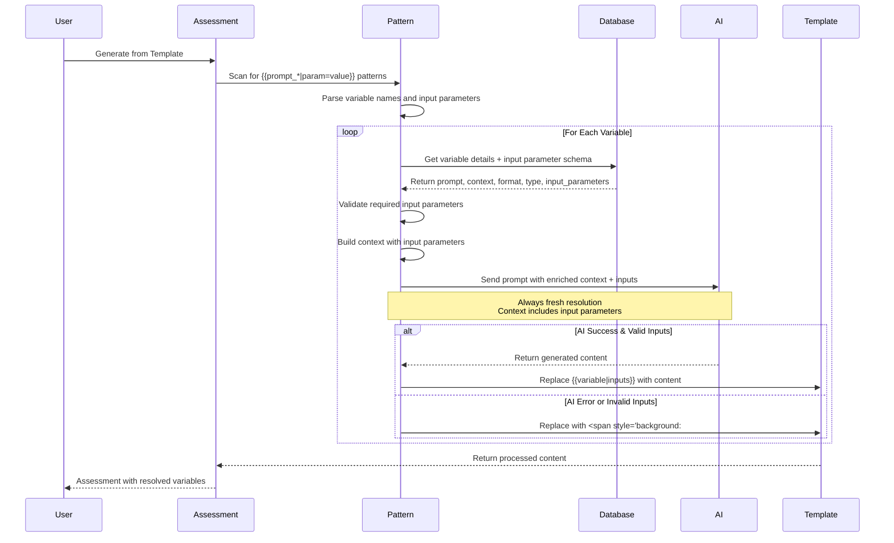

# New Template Variable Design Document

## Overview

This design document outlines the implementation of **Customer-Provided Prompt Template Variables** - a new feature that allows customers to define custom template variables with AI prompts directly within the CSM template editor. These prompt variables will be processed by the ask-ai data science pipeline to generate dynamic content when assessments are created from templates.

## Current System Analysis

### Existing Template Variable System

The current system uses static template variables:

- **TemplateVariable**: Stores static variables with labels and placeholders
- **TemplateVariableGroup**: Groups variables hierarchically
- **Templates**: Contains HTML content with variable placeholders
- **Assessment Generation**: Replaces variables with pre-defined functions during assessment creation

### Current AI Integration

- **AskAiService**: Handles AI queries for assessment content
- **OpenAiService**: Direct OpenAI integration for text generation
- **Data Science Pipeline**: External chat server for advanced AI processing

## Problem Statement

The current template variable system is limited to:
- Static, pre-written functions for variable resolution
- No customer customization capabilities within the template editor
- Limited dynamic content generation
- Hardcoded business logic for template population

## Proposed Solution

### High-Level Architecture

```
CSM Template Editor → Prompt Variables → Pattern Matching → AI Pipeline → Dynamic Content → Assessment Generation
```

### Core Features

1. **Reusable Variable Library**: Create prompt variables at customer level for use across all templates
2. **Visibility Scopes**: Support for GLOBAL, CONTROL_FAMILY, and CONTROL visibility scopes
3. **Unique Variable Naming**: Use `prompt_<name>_<uuid>` convention for uniqueness
4. **AI-Powered Resolution**: Use ask-ai pipeline with prompt, context, and output format
5. **Pattern-Based Detection**: Detect `{{prompt_*}}` patterns during assessment generation
6. **Error Handling**: Highlight failed variables with styled spans
7. **Variable Management**: Full CRUD operations, search, duplicate, and test functionality
8. **Context-Dependent Resolution**: Always fresh AI resolution based on current context (no caching)

## Detailed Design

### 1. Variable Naming Convention

All prompt variables will follow the naming pattern: `prompt_<user_name>_<uuid>`

Examples:
- `{{prompt_company_description_a1b2c3d4}}`
- `{{prompt_risk_assessment_e5f6g7h8}}`
- `{{prompt_compliance_summary_i9j0k1l2}}`

### 2. Template Editor Integration

#### Variable Creation Interface

The CSM template editor will include a new prompt variable creation feature:

```typescript
import { TemplateSectionType } from 'src/entities/templatesSection.entity';

interface PromptVariableCreation {
    display_name: string;           // User-friendly name (e.g., "Company Description")
    variable_name: string;          // Generated as prompt_<sanitized_name>_<uuid>
    description?: string;           // Optional description for organization
    prompt: string;                 // AI prompt provided by user
    context_source: string;         // Where to extract data from
    output_format: string;          // Expected output format
    type: TemplateSectionType;      // Visibility scope: GLOBAL, CONTROL_FAMILY, CONTROL
    group_id: number;               // Template variable group ID
    specific_use_case: boolean;     // If true, hidden from template editor
    input_parameters?: InputParameter[]; // Expected input parameters
}

interface InputParameter {
    name: string;                   // Parameter name (e.g., "control_id")
    label: string;                  // User-friendly label (e.g., "Control ID")
    type: 'text' | 'number' | 'select' | 'boolean'; // Input type
    required: boolean;              // Whether parameter is required
    description?: string;           // Parameter description
    options?: string[];             // For select type
    default_value?: any;            // Default value
}
```

#### Variable Insertion

Variables can be inserted into template content using these patterns:

**Basic Usage (No Input Parameters):**
`{{prompt_<name>_<uuid>}}`

**With Input Parameters:**
`{{prompt_<name>_<uuid>|control_id=AC-1|status=implemented}}`

**Examples:**
- `{{prompt_company_summary_a1b2c3d4}}` - Basic variable
- `{{prompt_control_details_e5f6g7h8|control_id=AC-2}}` - With control ID input
- `{{prompt_risk_analysis_i9j0k1l2|severity=high|category=technical}}` - Multiple inputs

#### Benefits of Reusable Variables

1. **Consistency**: Same variable can be used across multiple templates ensuring consistent AI-generated content
2. **Efficiency**: Create once, use everywhere - no need to recreate similar prompts
3. **Maintenance**: Update a variable once and it affects all templates using it
4. **Organization**: Centralized variable library with search and categorization
5. **Scalability**: As variable library grows, template creation becomes faster
6. **Quality Control**: Test and refine variables before deploying across multiple templates

#### Variable Organization Features

1. **Grouping System**: All prompt variables belong to template variable groups for better organization
2. **Hierarchical Groups**: Support for parent-child group relationships (inherited from existing system)
3. **Customer Groups**: Organizations can create custom groups for their specific needs
4. **Specific Use Cases**: Variables marked as specific use case are hidden from general template editor but available for programmatic use

#### Variable Visibility Scopes

Following the same pattern as templateVariable entity, prompt variables support three visibility scopes:

- **GLOBAL**: Available in all template sections and assessment contexts
- **CONTROL_FAMILY**: Available only in control family sections/contexts
- **CONTROL**: Available only in individual control sections/contexts

This scope-based approach ensures variables are only used in appropriate contexts and helps organize variables by their intended use case.

### 3. Database Schema Changes

#### Enhanced Entity: PromptTemplateVariable

```sql
-- Uses existing template_section_type enum (GLOBAL, CONTROL_FAMILY, CONTROL)
CREATE TABLE prompt_template_variables (
    id INT PRIMARY KEY AUTO_INCREMENT,
    variable_name VARCHAR(255) NOT NULL UNIQUE, -- prompt_<name>_<uuid>
    display_name VARCHAR(255) NOT NULL,
    description TEXT, -- Optional description for better organization
    prompt TEXT NOT NULL,
    context_source VARCHAR(500) NOT NULL,
    output_format TEXT NOT NULL,
    type template_section_type DEFAULT 'GLOBAL' NOT NULL, -- Visibility scope
    group_id INT NOT NULL, -- References template_variable_group
    specific_use_case BOOLEAN DEFAULT FALSE, -- If true, hidden from template editor
    input_parameters JSON, -- Defines expected input parameters
    customer_id VARCHAR(36) NOT NULL,
    is_active BOOLEAN DEFAULT TRUE,
    created_by VARCHAR(36) NOT NULL,
    created_at TIMESTAMP DEFAULT CURRENT_TIMESTAMP,
    updated_at TIMESTAMP DEFAULT CURRENT_TIMESTAMP ON UPDATE CURRENT_TIMESTAMP,
    
    INDEX idx_variable_name (variable_name),
    INDEX idx_customer (customer_id),
    INDEX idx_type (type),
    INDEX idx_group (group_id),
    INDEX idx_specific_use_case (specific_use_case),
    INDEX idx_active (is_active),
    FOREIGN KEY (customer_id) REFERENCES customers(id),
    FOREIGN KEY (group_id) REFERENCES template_variable_group(id)
);
```

#### Prompt Variable Group Extension

```sql
-- Extend existing template_variable_group table for prompt variable groups
ALTER TABLE template_variable_group 
ADD COLUMN IF NOT EXISTS customer_id VARCHAR(36),
ADD COLUMN IF NOT EXISTS is_custom BOOLEAN DEFAULT FALSE,
ADD INDEX idx_customer_custom (customer_id, is_custom);

-- Add foreign key constraint for customer-specific groups
ALTER TABLE template_variable_group 
ADD CONSTRAINT fk_variable_group_customer 
FOREIGN KEY (customer_id) REFERENCES customers(id);
```

### 4. TypeScript Entity Definition

```typescript
import { Column, CreateDateColumn, Entity, PrimaryGeneratedColumn, UpdateDateColumn } from "typeorm";
import { TemplateSectionType } from "./templatesSection.entity";

@Entity('prompt_template_variables')
export class PromptTemplateVariable {
    @PrimaryGeneratedColumn()
    id: number;

    @Column({ type: 'varchar', length: 255, nullable: false, unique: true })
    variable_name: string;

    @Column({ type: 'varchar', length: 255, nullable: false })
    display_name: string;

    @Column({ type: 'text', nullable: true })
    description: string;

    @Column({ type: 'text', nullable: false })
    prompt: string;

    @Column({ type: 'varchar', length: 500, nullable: false })
    context_source: string;

    @Column({ type: 'text', nullable: false })
    output_format: string;

    @Column({ type: 'enum', enum: TemplateSectionType, default: TemplateSectionType.GLOBAL })
    type: TemplateSectionType;

    @Column({ type: 'int', nullable: false })
    group_id: number;

    @Column({ type: 'boolean', default: false })
    specific_use_case: boolean;

    @Column({ type: 'json', nullable: true })
    input_parameters: InputParameter[];

    @Column({ type: 'varchar', length: 36, nullable: false })
    customer_id: string;

    @Column({ type: 'boolean', default: true })
    is_active: boolean;

    @Column({ type: 'varchar', length: 36, nullable: false })
    created_by: string;

    @CreateDateColumn({ name: 'created_at', nullable: true })
    created_at: Date;

    @UpdateDateColumn({ name: 'updated_at', nullable: true })
    updated_at: Date;
}
```

### 5. Assessment Generation Flow

#### Pattern Detection and Resolution

```typescript
@Injectable()
export class PromptVariableProcessor {
    private readonly PROMPT_VARIABLE_PATTERN = /\{\{prompt_[a-zA-Z0-9_\-]+(\|[^}]+)?\}\}/g;
    
    constructor(
        private promptVariableService: PromptVariableService,
        private askAiService: AskAiService,
        private logger: LoggerService
    ) {}

    async processTemplate(templateContent: string, assessmentContext: AssessmentContext): Promise<string> {
        // 1. Find all prompt variable patterns (including those with input parameters)
        const promptVariables = this.findPromptVariables(templateContent);
        
        if (promptVariables.length === 0) {
            return templateContent;
        }

        // 2. Resolve each variable
        const resolutions = await Promise.allSettled(
            promptVariables.map(variable => this.resolveVariable(variable, assessmentContext))
        );

        // 3. Replace variables in template
        let processedContent = templateContent;
        for (let i = 0; i < promptVariables.length; i++) {
            const variable = promptVariables[i];
            const resolution = resolutions[i];
            
            if (resolution.status === 'fulfilled') {
                processedContent = processedContent.replace(variable, resolution.value);
            } else {
                // Error handling - highlight failed variable
                const errorSpan = `<span style="background:#fbeeb8;">${variable}</span>`;
                processedContent = processedContent.replace(variable, errorSpan);
                this.logger.error(`Failed to resolve variable ${variable}:`, resolution.reason);
            }
        }

        return processedContent;
    }

    private findPromptVariables(content: string): string[] {
        const matches = content.match(this.PROMPT_VARIABLE_PATTERN);
        return matches ? [...new Set(matches)] : []; // Remove duplicates
    }

    private parseVariableWithInputs(fullVariable: string): { variableName: string; inputs: Record<string, any> } {
        // Remove {{ }} brackets
        const cleanVariable = fullVariable.slice(2, -2);
        
        // Split by pipe to separate variable name from inputs
        const parts = cleanVariable.split('|');
        const variableName = parts[0];
        const inputs: Record<string, any> = {};
        
        // Parse input parameters (key=value format)
        for (let i = 1; i < parts.length; i++) {
            const [key, value] = parts[i].split('=', 2);
            if (key && value) {
                inputs[key.trim()] = value.trim();
            }
        }
        
        return { variableName, inputs };
    }

    private async resolveVariable(fullVariable: string, context: AssessmentContext): Promise<string> {
        const { variableName, inputs } = this.parseVariableWithInputs(fullVariable);
        
        // Get variable details from database
        const variable = await this.promptVariableService.getVariableByName(variableName);
        
        if (!variable) {
            throw new Error(`Variable ${variableName} not found`);
        }

        // Validate required input parameters
        if (variable.input_parameters) {
            for (const param of variable.input_parameters) {
                if (param.required && !inputs[param.name]) {
                    throw new Error(`Required parameter '${param.name}' missing for variable ${variableName}`);
                }
            }
        }

                // Always resolve with AI (no caching due to context-dependent nature)
        const contextData = this.buildContextData(variable.context_source, context);
        
        // Add input parameters to context
        const enrichedContext = {
            ...contextData,
            input_parameters: inputs
        };

        const aiRequest = {
            prompt: variable.prompt,
            context: enrichedContext,
            output_format: variable.output_format,
            variable_inputs: inputs
        };

        const resolution = await this.askAiService.processPromptVariable(aiRequest);
        
        return resolution;
    }

    private buildContextData(contextSource: string, context: AssessmentContext): any {
        // Extract relevant data based on context_source specification
        // e.g., "customer.name, application.description, assessment.type"
        const contextData = {};
        
        const sources = contextSource.split(',').map(s => s.trim());
        
        for (const source of sources) {
            const [entity, field] = source.split('.');
            
            switch (entity) {
                case 'customer':
                    if (context.customer && context.customer[field]) {
                        contextData[source] = context.customer[field];
                    }
                    break;
                case 'application':
                    if (context.application && context.application[field]) {
                        contextData[source] = context.application[field];
                    }
                    break;
                case 'assessment':
                    if (context.assessment && context.assessment[field]) {
                        contextData[source] = context.assessment[field];
                    }
                    break;
            }
        }
        
        return contextData;
    }
}
```

### 6. Service Layer Implementation

#### PromptVariableService

```typescript
@Injectable()
export class PromptVariableService {
    constructor(
        @InjectRepository(PromptTemplateVariable)
        private promptVariableRepo: Repository<PromptTemplateVariable>,
        private askAiService: AskAiService
    ) {}

    async createPromptVariable(userInfo: any, data: CreatePromptVariableDto): Promise<PromptTemplateVariable> {
        // Generate unique variable name
        const uuid = this.generateShortUuid();
        const sanitizedName = this.sanitizeName(data.display_name);
        const variableName = `prompt_${sanitizedName}_${uuid}`;

        const variable = this.promptVariableRepo.create({
            variable_name: variableName,
            display_name: data.display_name,
            description: data.description,
            prompt: data.prompt,
            context_source: data.context_source,
            output_format: data.output_format,
            type: data.type,
            group_id: data.group_id,
            specific_use_case: data.specific_use_case,
            input_parameters: data.input_parameters,
            customer_id: userInfo.customerId,
            created_by: userInfo.sub
        });

        return await this.promptVariableRepo.save(variable);
    }

    async getCustomerVariables(customerId: string): Promise<PromptTemplateVariable[]> {
        return await this.promptVariableRepo.find({
            where: { customer_id: customerId, is_active: true },
            order: { created_at: 'DESC' }
        });
    }

    async getVariableByName(variableName: string): Promise<PromptTemplateVariable | null> {
        return await this.promptVariableRepo.findOne({
            where: { variable_name: variableName, is_active: true }
        });
    }

    async searchVariables(customerId: string, searchTerm?: string, type?: TemplateSectionType, includeSpecificUseCase = false): Promise<PromptTemplateVariable[]> {
        const queryBuilder = this.promptVariableRepo.createQueryBuilder('variable')
            .leftJoinAndSelect('variable.group', 'group')
            .where('variable.customer_id = :customerId', { customerId })
            .andWhere('variable.is_active = :isActive', { isActive: true });

        if (!includeSpecificUseCase) {
            queryBuilder.andWhere('variable.specific_use_case = :specificUseCase', { specificUseCase: false });
        }

        if (searchTerm) {
            queryBuilder.andWhere(
                '(variable.display_name ILIKE :searchTerm OR variable.description ILIKE :searchTerm OR variable.variable_name ILIKE :searchTerm)',
                { searchTerm: `%${searchTerm}%` }
            );
        }

        if (type) {
            queryBuilder.andWhere('variable.type = :type', { type });
        }

        return await queryBuilder
            .orderBy('group.order_index', 'ASC')
            .addOrderBy('variable.type', 'ASC')
            .addOrderBy('variable.created_at', 'DESC')
            .getMany();
    }

    async getVariablesByType(customerId: string, type: TemplateSectionType): Promise<PromptTemplateVariable[]> {
        return await this.promptVariableRepo.find({
            where: { customer_id: customerId, type: type, is_active: true, specific_use_case: false },
            relations: ['group'],
            order: { created_at: 'DESC' }
        });
    }

    async getVariablesByGroup(customerId: string, groupId: number): Promise<PromptTemplateVariable[]> {
        return await this.promptVariableRepo.find({
            where: { customer_id: customerId, group_id: groupId, is_active: true },
            relations: ['group'],
            order: { created_at: 'DESC' }
        });
    }

    async getTemplateEditorVariables(customerId: string, type?: TemplateSectionType): Promise<PromptTemplateVariable[]> {
        // Only returns variables that are not marked as specific_use_case
        const queryBuilder = this.promptVariableRepo.createQueryBuilder('variable')
            .leftJoinAndSelect('variable.group', 'group')
            .where('variable.customer_id = :customerId', { customerId })
            .andWhere('variable.is_active = :isActive', { isActive: true })
            .andWhere('variable.specific_use_case = :specificUseCase', { specificUseCase: false });

        if (type) {
            queryBuilder.andWhere('variable.type = :type', { type });
        }

        return await queryBuilder
            .orderBy('group.order_index', 'ASC')
            .addOrderBy('variable.type', 'ASC')
            .addOrderBy('variable.created_at', 'DESC')
            .getMany();
    }


    private sanitizeName(name: string): string {
        return name.toLowerCase()
                  .replace(/[^a-z0-9]/g, '_')
                  .replace(/_+/g, '_')
                  .replace(/^_|_$/g, '');
    }

    private generateShortUuid(): string {
        return Math.random().toString(36).substr(2, 8);
    }

    private generateContextHash(variableName: string, assessmentId: number): string {
        const crypto = require('crypto');
        return crypto.createHash('md5').update(`${variableName}_${assessmentId}`).digest('hex');
    }

    async getVariableById(variableId: number): Promise<PromptTemplateVariable | null> {
        return await this.promptVariableRepo.findOne({
            where: { id: variableId, is_active: true }
        });
    }

    async updatePromptVariable(variableId: number, data: UpdatePromptVariableDto): Promise<PromptTemplateVariable> {
        const variable = await this.getVariableById(variableId);
        if (!variable) {
            throw new Error('Variable not found');
        }

        Object.assign(variable, data);
        return await this.promptVariableRepo.save(variable);
    }

    async deletePromptVariable(variableId: number): Promise<void> {
        await this.promptVariableRepo.update(variableId, { is_active: false });
    }

    async duplicateVariable(variableId: number, userInfo: any, newDisplayName?: string): Promise<PromptTemplateVariable> {
        const originalVariable = await this.getVariableById(variableId);
        if (!originalVariable) {
            throw new Error('Variable not found');
        }

        const uuid = this.generateShortUuid();
        const displayName = newDisplayName || `${originalVariable.display_name} (Copy)`;
        const sanitizedName = this.sanitizeName(displayName);
        const variableName = `prompt_${sanitizedName}_${uuid}`;

        const duplicatedVariable = this.promptVariableRepo.create({
            variable_name: variableName,
            display_name: displayName,
            description: originalVariable.description,
            prompt: originalVariable.prompt,
            context_source: originalVariable.context_source,
            output_format: originalVariable.output_format,
            type: originalVariable.type,
            group_id: originalVariable.group_id,
            specific_use_case: originalVariable.specific_use_case,
            input_parameters: originalVariable.input_parameters,
            customer_id: userInfo.customerId,
            created_by: userInfo.sub
        });

        return await this.promptVariableRepo.save(duplicatedVariable);
    }

    async testVariable(variableId: number, testContext: any): Promise<string> {
        const variable = await this.getVariableById(variableId);
        if (!variable) {
            throw new Error('Variable not found');
        }

        // Build mock assessment context for testing
        const mockContext: AssessmentContext = {
            customer: testContext.customer || {},
            application: testContext.application || {},
            assessment: testContext.assessment || {},
            user: testContext.user || {}
        };

        const aiRequest = {
            prompt: variable.prompt,
            context: this.buildContextData(variable.context_source, mockContext),
            output_format: variable.output_format
        };

        // This would call the ask-ai service for testing
        return await this.askAiService.processPromptVariable(aiRequest);
    }

    private buildContextData(contextSource: string, context: AssessmentContext): any {
        // Extract relevant data based on context_source specification
        // e.g., "customer.name, application.description, assessment.type"
        const contextData = {};
        
        const sources = contextSource.split(',').map(s => s.trim());
        
        for (const source of sources) {
            const [entity, field] = source.split('.');
            
            switch (entity) {
                case 'customer':
                    if (context.customer && context.customer[field]) {
                        contextData[source] = context.customer[field];
                    }
                    break;
                case 'application':
                    if (context.application && context.application[field]) {
                        contextData[source] = context.application[field];
                    }
                    break;
                case 'assessment':
                    if (context.assessment && context.assessment[field]) {
                        contextData[source] = context.assessment[field];
                    }
                    break;
            }
        }
        
        return contextData;
    }
}
```

### 7. API Endpoints

#### Reusable Prompt Variables Management

```typescript
@Controller('prompt-variables')
@UseGuards(JwtAuthGuard)
@UseInterceptors(TransformInterceptor)
export class PromptVariableController {
    
    @Post()
    @Roles(UserRole.CSM, UserRole.OrgAdmin)
    async createPromptVariable(
        @Request() req: any,
        @Body() data: CreatePromptVariableDto
    ): Promise<StandardResponse<PromptTemplateVariable>> {
        const variable = await this.promptVariableService.createPromptVariable(req.user, data);
        return StandardResponse.success('Prompt variable created successfully', variable);
    }

    @Get()
    async getCustomerPromptVariables(
        @Request() req: any,
        @Query('search') searchTerm?: string,
        @Query('type') type?: TemplateSectionType,
        @Query('include_specific') includeSpecificUseCase?: boolean
    ): Promise<StandardResponse<PromptTemplateVariable[]>> {
        const variables = await this.promptVariableService.searchVariables(req.user.customerId, searchTerm, type, includeSpecificUseCase);
        return StandardResponse.success('Variables retrieved successfully', variables);
    }

    @Get('template-editor')
    async getTemplateEditorVariables(
        @Request() req: any,
        @Query('type') type?: TemplateSectionType
    ): Promise<StandardResponse<PromptTemplateVariable[]>> {
        const variables = await this.promptVariableService.getTemplateEditorVariables(req.user.customerId, type);
        return StandardResponse.success('Template editor variables retrieved successfully', variables);
    }

    @Get('by-type/:type')
    async getVariablesByType(
        @Request() req: any,
        @Param('type') type: TemplateSectionType
    ): Promise<StandardResponse<PromptTemplateVariable[]>> {
        const variables = await this.promptVariableService.getVariablesByType(req.user.customerId, type);
        return StandardResponse.success('Variables retrieved successfully', variables);
    }

    @Get('by-group/:groupId')
    async getVariablesByGroup(
        @Request() req: any,
        @Param('groupId') groupId: number
    ): Promise<StandardResponse<PromptTemplateVariable[]>> {
        const variables = await this.promptVariableService.getVariablesByGroup(req.user.customerId, groupId);
        return StandardResponse.success('Variables retrieved successfully', variables);
    }

    @Get('customer')
    async getAllCustomerVariables(
        @Request() req: any
    ): Promise<StandardResponse<PromptTemplateVariable[]>> {
        const variables = await this.promptVariableService.getCustomerVariables(req.user.customerId);
        return StandardResponse.success('All customer variables retrieved successfully', variables);
    }

    @Get(':variableId')
    async getPromptVariable(
        @Param('variableId') variableId: number
    ): Promise<StandardResponse<PromptTemplateVariable>> {
        const variable = await this.promptVariableService.getVariableById(variableId);
        return StandardResponse.success('Variable retrieved successfully', variable);
    }

    @Put(':variableId')
    @Roles(UserRole.CSM, UserRole.OrgAdmin)
    async updatePromptVariable(
        @Param('variableId') variableId: number,
        @Body() data: UpdatePromptVariableDto
    ): Promise<StandardResponse<PromptTemplateVariable>> {
        const variable = await this.promptVariableService.updatePromptVariable(variableId, data);
        return StandardResponse.success('Variable updated successfully', variable);
    }

    @Delete(':variableId')
    @Roles(UserRole.CSM, UserRole.OrgAdmin)
    async deletePromptVariable(
        @Param('variableId') variableId: number
    ): Promise<StandardResponse<void>> {
        await this.promptVariableService.deletePromptVariable(variableId);
        return StandardResponse.success('Variable deleted successfully');
    }

    @Post(':variableId/test')
    @Roles(UserRole.CSM, UserRole.OrgAdmin)
    async testPromptVariable(
        @Param('variableId') variableId: number,
        @Body() testContext: any
    ): Promise<StandardResponse<string>> {
        const result = await this.promptVariableService.testVariable(variableId, testContext);
        return StandardResponse.success('Variable test completed', result);
    }

    @Post(':variableId/duplicate')
    @Roles(UserRole.CSM, UserRole.OrgAdmin)
    async duplicatePromptVariable(
        @Request() req: any,
        @Param('variableId') variableId: number,
        @Body() data: { display_name?: string }
    ): Promise<StandardResponse<PromptTemplateVariable>> {
        const variable = await this.promptVariableService.duplicateVariable(variableId, req.user, data.display_name);
        return StandardResponse.success('Variable duplicated successfully', variable);
    }
}
```

### 8. Data Transfer Objects

```typescript
export class CreatePromptVariableDto {
    @IsString()
    @IsNotEmpty()
    @MaxLength(100)
    display_name: string;

    @IsString()
    @IsOptional()
    @MaxLength(500)
    description?: string; // Optional description for better organization

    @IsString()
    @IsNotEmpty()
    @MaxLength(2000)
    prompt: string;

    @IsString()
    @IsNotEmpty()
    @MaxLength(500)
    context_source: string; // e.g., "customer.name, application.description"

    @IsString()
    @IsNotEmpty()
    @MaxLength(1000)
    output_format: string; // e.g., "Plain text, maximum 200 words"

    @IsEnum(TemplateSectionType)
    type: TemplateSectionType; // Visibility scope: GLOBAL, CONTROL_FAMILY, CONTROL

    @IsNumber()
    @IsNotEmpty()
    group_id: number; // Template variable group ID

    @IsBoolean()
    @IsOptional()
    specific_use_case?: boolean = false; // If true, hidden from template editor

    @IsArray()
    @IsOptional()
    @ValidateNested({ each: true })
    @Type(() => InputParameterDto)
    input_parameters?: InputParameterDto[]; // Expected input parameters
}

export class InputParameterDto {
    @IsString()
    @IsNotEmpty()
    name: string;

    @IsString()
    @IsNotEmpty()
    label: string;

    @IsEnum(['text', 'number', 'select', 'boolean'])
    type: 'text' | 'number' | 'select' | 'boolean';

    @IsBoolean()
    required: boolean;

    @IsString()
    @IsOptional()
    description?: string;

    @IsArray()
    @IsOptional()
    options?: string[];

    @IsOptional()
    default_value?: any;
}

export class UpdatePromptVariableDto extends PartialType(CreatePromptVariableDto) {}

export interface AssessmentContext {
    customer: Customer;
    application: App;
    assessment: AssessmentDetail;
    user: User;
}

// Import the existing enum
import { TemplateSectionType } from 'src/entities/templatesSection.entity';

export interface AiPromptRequest {
    prompt: string;
    context: any;
    output_format: string;
}
```

### 9. Enhanced Assessment Generation

```typescript
// Add to existing AssessmentService
async generateAssessmentFromTemplate(
    userInfo: any,
    templateId: number,
    assessmentData: CreateAssessmentDto
): Promise<AssessmentDetail> {
    // 1. Create basic assessment
    const assessment = await this.createBasicAssessment(userInfo, assessmentData);
    
    // 2. Get template content
    const template = await this.getTemplate(templateId);
    
    // 3. Build assessment context
    const context: AssessmentContext = {
        customer: await this.getCustomer(userInfo.customerId),
        application: await this.getApplication(assessmentData.applicationId),
        assessment: assessment,
        user: await this.getUser(userInfo.sub)
    };
    
    // 4. Process prompt variables in template
    const processedContent = await this.promptVariableProcessor.processTemplate(
        template.template_html,
        context
    );
    
    // 5. Update assessment with processed content
    assessment.template_html = processedContent;
    await this.assessmentRepo.save(assessment);
    
    return assessment;
}
```

## System Flow Diagrams

### 1. Enhanced Variable Creation and Usage with Groups

```mermaid
graph TD
    A[CSM Access Variable Management] --> B[Create New Variable]
    B --> C[Fill Variable Details]
    C --> D[Display Name & Description]
    C --> E[AI Prompt]
    C --> F[Context Source]
    C --> G[Output Format]
    C --> H[Select Visibility Scope]
    C --> I[Select/Create Group]
    C --> J[Set Specific Use Case Flag]
    C --> K[Define Input Parameters]
    D --> L[Generate Unique Variable Name]
    E --> L
    F --> L
    G --> L
    H --> L
    I --> L
    J --> L
    K --> L
    L --> M[Save to Customer Scope with Group]
    M --> N[Variable Available Based on Flags]
    
    O[Template Editor] --> P[Browse Variables by Group/Scope]
    P --> Q[Filter: Group, Type, General Use Only]
    Q --> R[Select Existing Variable]
    R --> S{Variable has Input Parameters?}
    S -->|No| T[Insert {{prompt_name_uuid}}]
    S -->|Yes| U[Insert {{prompt_name_uuid|param1=value1|param2=value2}}]
    T --> V[Variable Ready for Use]
    U --> V
    
    N --> P
    
    style L fill:#e1f5fe
    style M fill:#f3e5f5
    style P fill:#e8f5e8
    style Q fill:#fff3e0
    style S fill:#ffe0b2
```

### 2. Assessment Generation with Input Parameters (No Caching)



### 3. Error Handling Flow

```mermaid
graph TD
    A[Variable Resolution] --> B{AI Call Successful?}
    B -->|Yes| C[Replace with Generated Content]
    B -->|No| D[Create Error Span]
    D --> E[<span style="background:#fbeeb8;">{{variable}}</span>]
    E --> F[Log Error Details]
    F --> G[Continue with Next Variable]
    C --> G
    G --> H[Return Processed Template]
    
    style D fill:#ffebee
    style E fill:#ffebee
    style F fill:#fff3e0
```

## Security Considerations

### 1. Prompt Injection Prevention

- **Input Sanitization**: Sanitize all customer prompts to prevent injection attacks
- **Prompt Templates**: Use structured prompt templates to limit attack surface
- **Content Filtering**: Implement content filtering for AI responses
- **Rate Limiting**: Limit prompt execution frequency per customer

### 2. Access Control

- **Role-Based Access**: Only OrgAdmin and CSM can create/modify prompt variables
- **Customer Isolation**: Strict isolation between customer prompt variables
- **Audit Logging**: Comprehensive logging of all prompt variable operations

### 3. Data Privacy

- **Context Filtering**: Only include necessary context data in AI prompts
- **PII Protection**: Automatically detect and mask PII in prompts
- **Retention Policies**: Implement data retention for cached resolutions

## Performance Considerations

### 1. Caching Strategy

- **Multi-Level Cache**: Redis for hot cache, database for persistent cache
- **Cache Invalidation**: Smart invalidation based on context changes
- **TTL Management**: Configurable TTL based on variable type and context

### 2. Asynchronous Processing

- **Queue-Based Processing**: Use SQS for long-running AI resolutions
- **Batch Processing**: Process multiple variables in batches
- **Retry Logic**: Implement exponential backoff for failed resolutions

### 3. Resource Management

- **Connection Pooling**: Efficient database connection management
- **Memory Management**: Optimize memory usage for large assessments
- **AI API Limits**: Respect OpenAI API rate limits and usage quotas

## Migration Strategy

### Phase 1: Foundation (Week 1-2)
- Create database schema
- Implement core entities and repositories
- Basic CRUD operations for prompt variables

### Phase 2: Core Functionality (Week 3-4)
- Implement PromptVariableService
- Basic AI integration for variable resolution
- Simple caching mechanism

### Phase 3: Integration (Week 5-6)
- Integrate with assessment generation
- Enhanced template processing
- API endpoints and controllers

### Phase 4: Advanced Features (Week 7-8)
- Performance optimizations
- Advanced caching strategies
- Security enhancements

### Phase 5: Testing & Deployment (Week 9-10)
- Comprehensive testing
- Documentation
- Production deployment

## Testing Strategy

### 1. Unit Tests
- Service layer methods
- Variable resolution logic
- Cache management
- Prompt validation

### 2. Integration Tests
- End-to-end assessment generation
- AI service integration
- Database operations
- API endpoints

### 3. Performance Tests
- Load testing for multiple concurrent resolutions
- Cache performance under load
- AI service response times
- Memory usage optimization

### 4. Security Tests
- Prompt injection testing
- Access control validation
- Data isolation verification
- PII protection testing

## Monitoring & Observability

### 1. Key Metrics
- **Variable Resolution Time**: Track AI processing time
- **Cache Hit Rate**: Monitor cache effectiveness
- **Error Rates**: Track resolution failures
- **Usage Patterns**: Monitor variable usage by customers

### 2. Alerts
- **High Error Rates**: Alert on resolution failures
- **Performance Degradation**: Monitor response times
- **Cache Issues**: Alert on cache failures
- **AI Service Limits**: Monitor API usage

### 3. Logging
- **Structured Logging**: Use structured logs for better analysis
- **Request Tracing**: Track request flow through system
- **Error Details**: Comprehensive error logging
- **Audit Trail**: Log all administrative operations

## Future Enhancements

### 1. Advanced Features
- **Variable Dependencies**: Support for variables that depend on other variables
- **Conditional Variables**: Variables that resolve based on conditions
- **Multi-Language Support**: Support for multiple languages in prompts
- **Custom AI Models**: Allow customers to use their own AI models

### 2. UI/UX Improvements
- **Visual Prompt Builder**: Drag-and-drop prompt creation interface
- **Live Preview**: Real-time preview of variable resolution
- **Template Designer**: Visual template design with variable placement
- **Usage Analytics**: Dashboard showing variable usage and performance

### 3. Enterprise Features
- **Approval Workflows**: Require approval for new prompt variables
- **Version Control**: Track changes to prompts over time
- **A/B Testing**: Allow testing different prompt variations
- **Compliance Reporting**: Generate reports on prompt usage and content

## Example Use Cases

### 1. Basic Variable (No Input Parameters)
```typescript
// Variable Definition
{
    display_name: "Company Risk Summary",
    prompt: "Generate a comprehensive risk summary for the organization based on their compliance assessment",
    context_source: "customer.name, assessment.type, application.description",
    output_format: "HTML formatted text, maximum 300 words",
    type: TemplateSectionType.GLOBAL,
    group_id: 1, // Organization group
    specific_use_case: false,
    input_parameters: []
}

// Template Usage
{{prompt_company_risk_summary_a1b2c3d4}}
```

### 2. Variable with Input Parameters
```typescript
// Variable Definition
{
    display_name: "Specific Control Details",
    prompt: "Provide detailed information about the specific control including its implementation status, requirements, and recommendations",
    context_source: "customer.name, application.name, assessment.type",
    output_format: "Structured HTML with sections for description, status, and recommendations",
    type: TemplateSectionType.CONTROL,
    group_id: 9, // Control group
    specific_use_case: false,
    input_parameters: [
        {
            name: "control_id",
            label: "Control ID",
            type: "text",
            required: true,
            description: "The specific control identifier (e.g., AC-1, AU-2)"
        },
        {
            name: "include_recommendations",
            label: "Include Recommendations",
            type: "boolean",
            required: false,
            default_value: true
        }
    ]
}

// Template Usage
{{prompt_specific_control_details_e5f6g7h8|control_id=AC-2|include_recommendations=true}}
```

### 3. Specific Use Case Variable (Hidden from Template Editor)
```typescript
// Variable Definition
{
    display_name: "Automated Risk Calculation",
    prompt: "Calculate risk score based on control implementation status and organizational factors",
    context_source: "assessment.controls, customer.industry, application.criticality",
    output_format: "JSON object with risk_score, factors, and explanation",
    type: TemplateSectionType.GLOBAL,
    group_id: 10, // Internal group
    specific_use_case: true, // Hidden from template editor
    input_parameters: [
        {
            name: "calculation_method",
            label: "Calculation Method",
            type: "select",
            required: true,
            options: ["standard", "weighted", "custom"]
        }
    ]
}

// Programmatic Usage (not visible in template editor)
{{prompt_automated_risk_calculation_i9j0k1l2|calculation_method=weighted}}
```

## Conclusion

This design provides a comprehensive framework for implementing customer-provided prompt template variables that will significantly enhance the flexibility and customization capabilities of the KOVR platform. The solution balances functionality, performance, security, and maintainability while providing a clear migration path and extensive testing strategy.

Key enhancements include:
- **Organized Variable Library**: Grouping system for better organization
- **Context-Aware Variables**: Input parameters for dynamic content generation
- **Flexible Visibility**: Specific use case flags for different access levels
- **Template Integration**: Seamless integration with existing template system

The modular architecture ensures that the system can be extended with additional features in the future while maintaining backward compatibility with existing templates and assessments. 